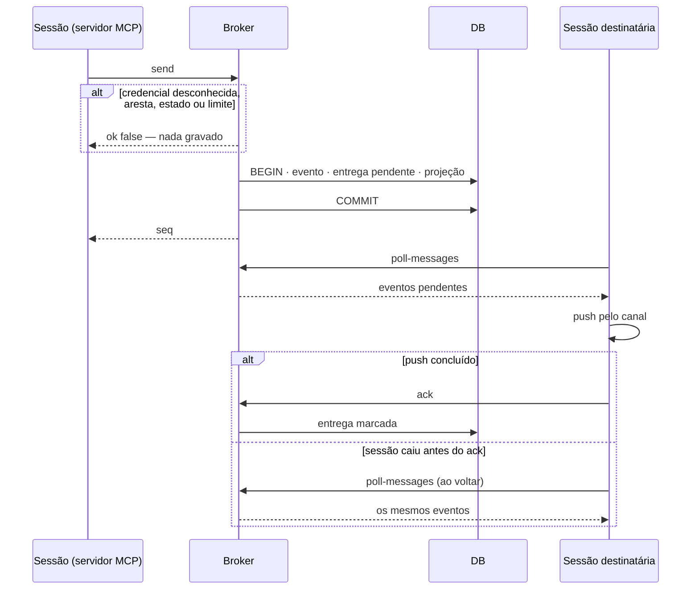
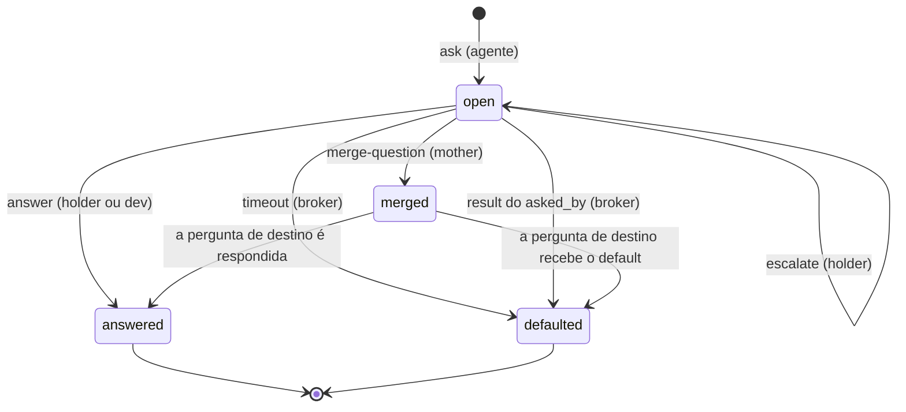
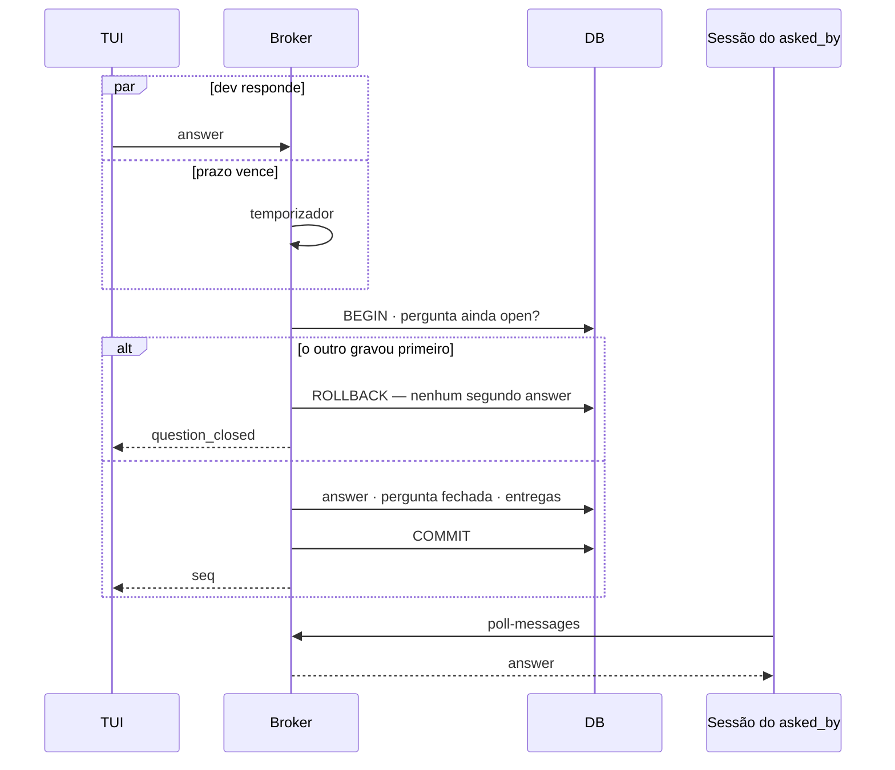
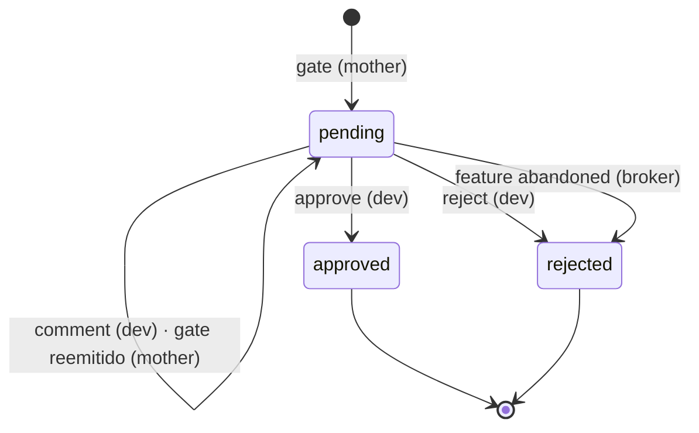

# Squad MVP: broker, contrato de eventos, TUI, papéis e gate

> Plan from this document. Each slice below carries its own shape - copy it, do not re-derive it.
> Status: confirmed by Lucas Fassi, 2026-10-07

## Situation

- Project: not shipped yet. O repositório só tem documentos; o código que existe é o do upstream `louislva/claude-peers-mcp`, lido no commit `640183f`.
- Decision: committed by Lucas Fassi, 2026-10-07, em `docs/start-document/START.md`: construir o MVP (fases 1 a 5), com a seção "Arquitetura (decidida)", os quatro papéis, a estrela, o máximo de 2 reworks e o "Fora do escopo" como dados.
- In flight: o fork copia do upstream o daemon HTTP em localhost com SQLite, o servidor MCP stdio por sessão e o push por canal. O desenho das telas está em `docs/claude-design-handoff/` e não é redesenhado aqui.
- At stake: expensive. O contrato de eventos é lido pelo broker, pela TUI e pelas quatro skills de papel; mudá-lo depois da fase 1 obriga a migrar o log e reescrever os três.

## Problem

Construção. O START.md prometeu que um dev consegue pôr várias sessões do Claude Code para trabalhar como um squad e acompanhar tudo de uma tela, respondendo só o que o squad não consegue decidir sozinho. Sem o contrato de eventos fechado nada começa: o broker da fase 1 não sabe o que gravar, a TUI da fase 2 não sabe o que ler, e as skills da fase 4 não sabem o que emitir. O contrato do START.md não carrega o que o design da TUI mostra (lacunas na seção 2.10 das notas) e contradiz o design em nove pontos. Por que agora: é a primeira peça, e todas as outras dependem dela.

Não há número a medir: nada foi lançado.

## Success

- Worked if: uma feature com pelo menos dois tickets vai do kickoff da mother ao gate aprovado com o dev usando apenas o terminal da mother e a TUI.
- Going wrong: o dev precisa entrar no terminal de um worker, leader ou judge mais de uma vez por feature (pedido de permissão parado, sessão travada, mensagem perdida).
- Review: depois da primeira feature real executada com as cinco fases prontas - Lucas Fassi.

## Boundary

In: o fork do broker, o contrato de eventos completo, a TUI de leitura, perguntas com resposta pela TUI, as skills de papel com `roles.json` e o launcher, e o gate humano.

Out: malha entre workers, embeddings, execução remota ou multi-máquina, UI web - fora do escopo no START.md.
Out: segundo cérebro (fase 6) - depois do MVP.
Out: mais de uma feature aberta ao mesmo tempo - o design só desenha uma; o `feature_id` em todo evento deixa a porta aberta.
Out: worker sob demanda (N13) e quarto worker - a estrela tem três posições.
Out: segredo digitado na TUI e "cofre do projeto" (N11) - Key decision 7.
Out: teto de custo e encerramento automático de sessão - o design não tem elemento para isso; a contenção do MVP é o limite de reworks e o dev olhando o total.
Out: exportar respostas do dev para ADR ou vault - o log persiste e é consultável por feature; o resto é da fase 6.
Out: reinício automático de sessão morta - o estado sobrevive no broker e a sessão é relançada à mão com o mesmo nome.
Out: `review` como kind - progresso parcial do judge custa tokens e interrompe o leader; o `verdict` carrega tudo.
Out: resumo automático de peer via OpenAI e o campo `summary` do peer - nome e papel o substituem.
Out: isolamento real contra um agente que chame o broker por fora das tools - Key decision 7 diz o que existe no lugar.
Out da TUI: topologia órbita (N21), filtros `f` `t` `/` (N23), esquemas de cor e estilos de seleção (N26), tokens por ticket e por etapa na tela (N25, parte), terminal menor que 120×40.

Unchanged: o daemon continua único por máquina, em `127.0.0.1`, com SQLite em modo WAL; o servidor MCP continua um processo stdio por sessão que registra, faz heartbeat e polling de 1 s; `/heartbeat`, `/unregister` e `/health` ficam como estão; a limpeza de peers por PID morto continua a cada 30 s.

## Shape

O registro é o evento: uma linha num log append-only com número sequencial, que é ao mesmo tempo a mensagem entre peers, o histórico e a fonte da TUI. A operação é sempre a mesma: o broker identifica quem chama pela credencial do registro, recusa o que a topologia ou o estado não permitem, e grava o evento junto com o que dele decorre. A porta é o envelope e a lista de kinds; mudá-los depois custa migrar o log e reescrever as skills de papel e a TUI. A TUI e os agentes não guardam estado próprio do squad: calculam-no a partir do log com uma função única.

A alternativa mais pesada é o broker como motor de workflow, que atribui tickets e conduz as transições em vez de só recusar as inválidas. Ela ganha se as skills de papel se mostrarem incapazes de seguir o protocolo; hoje não há evidência disso, porque nenhuma rodou.

## Key decisions

1. **O log é uma tabela única de eventos, append-only, com `seq` inteiro como único identificador; nenhum evento é alterado ou apagado.** Features, perguntas, gates e entregas pendentes são projeções gravadas na mesma transação do evento que as muda; um evento sem a sua projeção, ou o contrário, não existe. O upstream apaga mensagens não entregues quando o peer morre; não copiar isso.

2. **A identidade do peer vem do registro e nunca do corpo da chamada.** Nome e papel são dados no lançamento da sessão, são estáveis e são o endereço de entrega. O `id` aleatório do upstream passa a ser credencial secreta e deixa de aparecer em listagens. `from` e `role_from` são carimbados pelo broker. No upstream o remetente é um campo que quem chama preenche; não copiar isso.

3. **O envelope tem sete kinds de mensagem e oito de registro, `feature_id` em todos, e nada de `thread` nem uuid.** Mensagem: `task`, `result`, `verdict`, `question`, `answer`, `gate`, `gate_decision`. Registro: `feature_opened`, `feature_closed`, `peer_joined`, `peer_left`, `blocked`, `unblocked`, `usage`, `question_merged`. O kind é o discriminante; nenhum consumidor decide o significado de um evento olhando campos opcionais. `answer` é toda resposta a uma pergunta; `result` é só entrega e relatório. O autor de um evento gerado pelo broker é `"broker"`.

4. **A pergunta é uma entidade que nasce na origem com id dado pelo broker, mantém o id por toda a escalação e tem uma única resolução.** Não-bloqueante: o agente segue com o default na hora, e a pergunta fecha no primeiro de três fatos: resposta, timeout, ou o `result` do próprio agente para aquele ticket. O relógio do timeout começa quando a pergunta chega ao dev, não quando é criada. Bloqueante: só o agente de origem pausa, e espera sem prazo.

5. **Status não é reportado: é derivado do log por uma função única, usada pela TUI e pelo broker.** As exceções são presença, que o broker emite, e bloqueio, que o agente declara. A regra de derivação faz parte do contrato e muda junto com ele.

6. **A topologia e os limites são recusas do broker, não convenções das skills.** Arestas permitidas por kind e papel, uma feature aberta, no máximo três workers, um ticket por worker e dois reworks por ticket. O servidor MCP só expõe a cada sessão as tools do seu papel.

7. **Um gate tem exatamente uma decisão final, e a ação irreversível é executada só por quem a pediu, depois de `approve`, e exatamente como descrita.** `comment` não decide. O gate é um controle cooperativo, não uma barreira de segurança: um agente com shell alcança o broker em localhost. O que existe contra isso é uma credencial humana fora dos worktrees e a regra da skill. Segredos não passam pelo broker: uma pergunta nunca pede o valor de uma credencial, pede que o dev a coloque no lugar e confirme.

8. **A entrega é ao menos uma vez, confirmada depois do push, e acordar uma sessão ociosa depende do canal do Claude Code.** O upstream marca a mensagem como entregue no polling, antes de ela chegar à sessão; não copiar isso. O canal exige login claude.ai e a flag de canais de desenvolvimento; sem ele, um agente à espera não acorda.

## Work

| Slice | Delivers | Status |
|---|---|---|
| [Peer](#peer) | Sessões entram no broker com nome e papel estáveis; presença vira evento | clear |
| [Event](#event) | Log append-only, envio com recusa por topologia, entrega confirmada, leitura por cursor | clear |
| [Feature](#feature) | Abertura e encerramento de feature com workflow travado | clear |
| [TUI leitura](#tui-leitura) | Feed, agentes, tickets, topologia estrela e detalhe de ticket a partir do log | design |
| [Question](#question) | Perguntar, escalar, mesclar, responder e expirar; aba Perguntas e modais | design |
| [Papéis](#papéis) | `roles.json`, quatro skills de papel, launcher, plugin com hooks de uso e de permissão | open — 6 defaults taken |
| [Gate](#gate) | Pedido e decisão de gate; modal com texto e confirmação | design |

Order: Peer → Event → Feature → TUI leitura → Question → Papéis → Gate. Peer, Event e Feature são a fase 1 do START.md; as demais são as fases 2 a 5, uma slice cada.

Derivable from the repository, left to the plan: nomes de rota em kebab-case com `POST` e corpo JSON; recusa como resposta `200` com `{ ok: false, error }`; `404` para rota desconhecida; configuração por variável de ambiente com default - tudo como o upstream faz em `/send-message`. O fork usa porta e caminho de banco próprios para conviver com um claude-peers instalado na mesma máquina.

O fork precisa rodar no Windows, e o upstream não roda inteiro: o caminho do banco depende de `HOME`, a detecção de terminal usa `ps` e o comando de parar o broker usa `lsof`. O uso de `ps` some com a coluna `tty`; os outros dois são trabalho da fase 1.

Glossário: **feature** é o nível de cima (o que o design chama de "thread tlc"); **ticket** é o nível de baixo, identificado por `ticket_ref`; **peer** é uma sessão registrada; **holder** é quem tem a pergunta no momento; **loadout** são as skills extras de um ticket.

### Peer

**Delivers** o registro de uma sessão com nome e papel, e a presença como evento. **Status: clear.**

| State | What should happen | Caller sees |
|---|---|---|
| Sessão sobe com nome e papel | Peer registrado; evento `peer_joined` | `{ id }` |
| Sessão sobe sem papel | Não registra e não expõe tools: é uma sessão comum do Claude Code | nada |
| Papel fora dos quatro | Recusa | `invalid_role` |
| Nome já usado por um peer vivo | Recusa | `name_taken` |
| Nome de um peer que morreu | Registra; herda as entregas pendentes daquele nome | `{ id }` |
| Segunda mother, leader ou judge | Recusa | `role_taken` |
| Quarto worker | Recusa | `worker_limit` |
| Sessão encerra | Evento `peer_left` com `unregistered` | `{ ok: true }` |
| PID morre sem avisar | Evento `peer_left` com `died` na limpeza seguinte | - |
| Um peer lista os outros | Nome, papel e se está vivo; nunca o `id` | lista |

`POST /register` `{ pid, cwd, git_root, name, role }` → `{ id }`
`POST /list-peers` `{ id }` → `[{ name, role, online }]`

Table `peers`: `tty` e `summary` saem; `name` e `role` entram. A linha continua sendo apagada na saída, como no upstream; o histórico de presença está em `events`.

| Column | Type | Null | References | Note |
|---|---|---|---|---|
| `id` | text | no | | PK; credencial, nunca listada |
| `name` | text | no | | único; `mother`, `leader`, `judge`, `worker-1`..`worker-3` |
| `role` | text | no | | `mother` \| `leader` \| `worker` \| `judge` |
| `pid` | integer | no | | |
| `cwd` | text | no | | |
| `git_root` | text | yes | | diretório git comum, igual em todos os worktrees |
| `registered_at` | integer | no | | epoch ms |
| `last_seen` | integer | no | | epoch ms |

O upstream identifica o repositório pelo topo da árvore de trabalho, que é diferente em cada worktree. O fork precisa do diretório git comum para que os workers pertençam ao mesmo projeto da mother.

Alternatives considered: o broker atribuir o nome no registro - ganha se o launcher deixar de existir; hoje o nome precisa ser conhecido antes para relançar uma sessão morta no mesmo lugar.

### Event

**Delivers** o log, o envio de `task`, `result` e `verdict`, a entrega e a leitura. **Status: clear.** É a porta: Key decisions 1, 3 e 8.

Envelope, presente em todo evento:

| Campo | Tipo | Quem preenche | Nota |
|---|---|---|---|
| `seq` | inteiro | broker | ordem total; cursor de leitura; é o `msg #0416` da tela |
| `ts` | epoch ms | broker | |
| `kind` | texto | quem chama | um dos quinze |
| `feature_id` | inteiro ou nulo | broker | a feature aberta; nulo só em presença e em `usage` fora de feature |
| `from` | texto | broker | nome do peer, `"human"` ou `"broker"` |
| `role_from` | texto | broker | papel, `"human"` ou `"broker"` |
| `to` | texto ou nulo | quem chama | nome do peer, `"human"`, `"*"` ou nulo em registro sem destinatário |
| `summary` | texto, até 80 | quem chama | linha do feed; obrigatório nos kinds de mensagem |
| `body` | texto | quem chama | corpo completo |
| `ticket_ref` | texto ou nulo | quem chama | escolhido pelo leader; único dentro da feature |

Kinds de mensagem, com as arestas permitidas e os campos próprios:

| Kind | De → para | Campos próprios |
|---|---|---|
| `task` | mother → leader | nenhum; sem `ticket_ref` (kickoff ou acréscimo de escopo) |
| `task` | leader → worker | `ticket_ref`; `ticket_title` obrigatório no primeiro do ticket; `criteria?` (números na spec); `loadout` (skills extras) |
| `result` | worker → judge | `ticket_ref`, `branch`, `commit` |
| `result` | leader → mother | nenhum; relatório em lote, sem `ticket_ref` |
| `verdict` | judge → leader | `ticket_ref`; `outcome`: `approve` \| `rework`; `criteria`: lista de `{ n, text, pass, note? }` |
| `question` | worker → leader, judge → worker, judge → leader, leader → mother, mother → human | `question_id`, `asked_by`, `blocking`, `why`, `options?` (até 3), `default?`, `timeout_s?` |
| `answer` | holder → `asked_by`; broker → `asked_by` | `question_id`, `answer`, `resolved_by`: `human` \| `agent` \| `timeout_default` \| `result_default` |
| `gate` | mother → human | `gate_id`, `action`, `effect`, `diffstat?` (texto); o resumo vai no `body` |
| `gate_decision` | human → mother | `gate_id`; `decision`: `approve` \| `reject` \| `comment`; `text?` |

Kinds de registro:

| Kind | Autor | `to` | Campos próprios |
|---|---|---|---|
| `feature_opened` | mother | `*` | `title`, `workflow`: `tlc` \| `matt-pocock`, `branch`, `base_branch`, `spec_ref` |
| `feature_closed` | mother | `*` | `outcome`: `delivered` \| `abandoned` |
| `peer_joined` | broker | nulo | `peer`, `role` |
| `peer_left` | broker | nulo | `peer`, `reason`: `unregistered` \| `died` |
| `blocked` | o agente | nulo | `ticket_ref?`, `reason` (curto), `detail`, `last_action` |
| `unblocked` | o agente ou o broker | nulo | `peer` |
| `usage` | a sessão, por hook | nulo | `model`, `input`, `output`, `cache_write`, `cache_read` (diferenças desde o último envio) |
| `question_merged` | mother | nulo | `question_id`, `into` |

Regras do contrato que não cabem numa célula:
- `answer` é texto livre. Quem recebe não pode presumir que o valor é um dos `options`: a TUI sempre oferece "outra resposta".
- `default` é obrigatório quando `blocking` é falso, e `timeout_s` só existe nesse caso; ausente, vale 240.
- O broker emite `unblocked` sozinho quando o agente bloqueado envia o `result` do ticket ou sai.
- O contador de rework de um ticket é o número de `verdict` com `outcome: rework`. O leader não reporta ticket fechado à mother: o `verdict` de `approve` é o fechamento, e o leader manda um `result` em lote.
- O ticket não tem tabela nem evento de criação. Título e dono vêm do primeiro `task`; o dono é o `to` do `task` mais recente.

| State | What should happen | Caller sees |
|---|---|---|
| Kind e aresta permitidos, feature aberta | Evento gravado; entrega pendente criada para o destinatário | `{ ok: true, seq }` |
| Aresta não permitida para o papel de quem chama | Nada gravado | `edge_not_allowed` |
| Destinatário não é um nome conhecido do squad | Nada gravado | `unknown_recipient` |
| Destinatário conhecido mas offline | Evento gravado; a entrega fica pendente até uma sessão registrar aquele nome | `{ ok: true, seq }` |
| Sem feature aberta | Nada gravado | `no_open_feature` |
| `task` para worker que tem outro ticket aberto | Nada gravado | `worker_busy` |
| `task` de ticket novo sem `ticket_title` | Nada gravado | `missing_field` |
| Terceiro `task` de rework no mesmo ticket | Nada gravado; o leader escala à mother com uma `question` | `rework_limit` |
| `verdict` sem `outcome` ou sem `criteria` | Nada gravado | `missing_field` |
| `result` de worker sem `branch` e `commit` | Nada gravado | `missing_field` |
| Sessão faz polling | Recebe as entregas pendentes do seu nome, em ordem de `seq` | lista de eventos |
| Sessão confirma depois do push | Entregas marcadas | `{ ok: true }` |
| Sessão cai entre o polling e a confirmação | As mesmas entregas voltam no polling seguinte; o `seq` permite reconhecer a repetição | - |
| TUI lê depois de um cursor | Todos os eventos com `seq` maior, de qualquer feature | `{ events, last_seq }` |
| Agente consulta o histórico de um ticket, pergunta ou gate | Os eventos daquele filtro, em ordem | lista de eventos |

`POST /send` `{ id, kind, to, summary, body, ticket_ref?, ...campos do kind }` → `{ ok, seq }`
`POST /poll-messages` `{ id }` → `{ events }`
`POST /ack` `{ id, seqs }` → `{ ok }`
`POST /history` `{ id, ticket_ref? | question_id? | gate_id? }` → `{ events }`
`POST /blocked` `{ id, ticket_ref?, reason, detail, last_action }` → `{ ok, seq }`
`POST /unblocked` `{ id }` → `{ ok, seq }`
`POST /usage` `{ id, model, input, output, cache_write, cache_read }` → `{ ok, seq }`
`GET /events?after=<seq>` → `{ events, last_seq }`

Table `events`; substitui `messages`, que deixa de existir.

| Column | Type | Null | References | Note |
|---|---|---|---|---|
| `seq` | integer | no | | PK autoincremento, como `messages.id` no upstream |
| `ts` | integer | no | | epoch ms |
| `kind` | text | no | | um dos quinze |
| `feature_id` | integer | yes | `features.id` | |
| `from_name` | text | no | | |
| `role_from` | text | no | | |
| `to_name` | text | yes | | |
| `summary` | text | no | | vazio em registro |
| `body` | text | no | | |
| `ticket_ref` | text | yes | | índice com `feature_id` |
| `question_id` | integer | yes | `questions.id` | indexado |
| `gate_id` | integer | yes | `gates.id` | indexado |
| `data` | text | no | | JSON com os campos próprios do kind |

Table `deliveries`.

| Column | Type | Null | References | Note |
|---|---|---|---|---|
| `event_seq` | integer | no | `events.seq` | PK com `recipient` |
| `recipient` | text | no | | nome do peer, não o `id` |
| `acked_at` | integer | yes | | nulo = pendente |

Alternatives considered: JSONL em arquivo além do SQLite - ganha se outra ferramenta precisar seguir o log sem falar com o broker; hoje a única leitora é a TUI. Uuid além do `seq` - ganha se um evento precisar ser citado fora do banco, o que só a fase 6 pediria. `diffstat` e `criteria` como tabelas próprias - ganham se alguém precisar consultá-los por SQL.

### Feature

**Delivers** a abertura e o encerramento do nível de cima. **Status: clear.**

A feature é aberta quando a spec está pronta e a mother vai entregá-la ao leader, não quando a mother começa a conversar com o dev. A conversa de descoberta acontece no terminal da mother, fora do broker; o uso dessa fase é registrado sem `feature_id` e aparece no total da sessão, não no da feature. Assim não existe feature aberta sem spec. Isto troca a frase do START.md "o Leader trava [o workflow] no início do thread" por "a mother trava o workflow na abertura da feature", porque a spec já foi escrita num dos dois workflows.

Uma feature tem dois estados, aberta e fechada, e só a mother a move.

| State | What should happen | Caller sees |
|---|---|---|
| Mother abre com spec, workflow e branch | Feature criada; `feature_opened` entregue a todos | `{ ok: true, feature_id }` |
| Já existe feature aberta | Recusa | `feature_already_open` |
| Abertura sem `spec_ref` ou sem `workflow` | Recusa | `missing_field` |
| Quem chama não é a mother | Recusa | `edge_not_allowed` |
| Mother encerra como `delivered` com gate de entrega aprovado | Feature fechada; `feature_closed` entregue a todos | `{ ok: true }` |
| Mother encerra como `delivered` sem gate aprovado | Recusa. A regra entra com a slice Gate; antes dela o encerramento é aceito | `gate_required` |
| Mother encerra como `abandoned` | Feature fechada; perguntas abertas resolvidas pelo default ou descartadas; gates pendentes rejeitados | `{ ok: true }` |
| Sem feature aberta | `ocioso desde` é o `ts` do último `feature_closed` | - |

`POST /open-feature` `{ id, title, workflow, branch, base_branch, spec_ref }` → `{ ok, feature_id }`
`POST /close-feature` `{ id, outcome, body }` → `{ ok }`

Table `features`.

| Column | Type | Null | References | Note |
|---|---|---|---|---|
| `id` | integer | no | | PK |
| `project` | text | no | | derivado do `git_root` da mother; não é campo do evento |
| `title` | text | no | | |
| `workflow` | text | no | | `tlc` \| `matt-pocock`; imutável |
| `branch` | text | no | | |
| `base_branch` | text | no | | |
| `spec_ref` | text | no | | caminho da spec no repositório |
| `opened_seq` | integer | no | `events.seq` | |
| `closed_seq` | integer | yes | `events.seq` | no máximo uma linha com nulo |
| `outcome` | text | yes | | `delivered` \| `abandoned` |

### TUI leitura

**Delivers** as telas 01, 02, 03, 09, 10 e 11 do handoff, lendo o log por cursor. **Status: design.** As telas estão em `docs/claude-design-handoff/`; o que segue é o que elas não decidem.

A TUI não lê o banco: lê `GET /events` a cada segundo e calcula o estado com a função de derivação (Key decision 5). Ela é escrita em TypeScript sobre o mesmo runtime do broker, para compartilhar os tipos do contrato e essa função; por isso Textual está fora.

A tela é um buffer de células de 120×40, e cada tela é uma função pura do estado derivado para esse buffer; um modal é desenhado por cima do buffer escurecido. É a forma que o protótipo do handoff já tem, então as funções de desenho são portadas em vez de reescritas, e cada frame do handoff vira um caso de teste: mesmo estado, mesmas 40 linhas. Ink não é usado. Ele resolve layout que reflui e componentes prontos, e este design é uma grade de coordenadas fixas em que a topologia é um desenho de arestas, não um layout; com Ink, cada tela teria de ser reexpressa em caixas flexíveis ou embrulhada inteira num único bloco de texto.

Derivação do status do agente, por precedência:

| Status | Regra |
|---|---|
| `offline` | o último evento de presença do nome é `peer_left`. Não está no design; ocupa o lugar dos cinco status |
| `blocked` | há um `blocked` do agente sem `unblocked` depois |
| `waiting ?` | o agente é `asked_by` de uma pergunta bloqueante aberta |
| `waiting` | o agente escalou uma pergunta ainda aberta ou pediu um gate ainda pendente, e não tem ticket em andamento |
| `working` | worker com ticket em `working`; judge com `result` sem `verdict`; leader com algum ticket não concluído; mother com feature aberta e nada pendente com o dev |
| `done` | todos os tickets da feature aberta estão aprovados |
| `idle` | o resto: sem feature aberta, ou worker sem ticket |

Um worker cujo ticket foi aprovado enquanto outros ainda trabalham fica `idle` com a atividade `TKT-14 ✓`; passa a `done` quando o último ticket é aprovado. Isso reproduz os dois cenários do mock.

Derivação do status do ticket: `working` se o último evento do ticket é `task`; `review` se é `result`; `done` se é `verdict` de `approve`; `escalated` no terceiro `verdict` de `rework`; `waiting` e `blocked` quando o worker dono está nesse status por causa do ticket.

| State | What should happen |
|---|---|
| Feature aberta, eventos chegando | Feed `● ao vivo`; cabeçalho com projeto, título e workflow da feature |
| Evento de mensagem | Linha `hora de para kind corpo`, com `summary` no corpo. `answer` e `gate` têm cor e legenda próprias, que o design não tem |
| `answer` com `resolved_by` de default | Linha de sistema amarela, sem `de → para` |
| `blocked` | Linha de sistema vermelha; selo `⚠ N agente bloqueado`; detalhe com motivo, detalhe e última ação |
| Aresta ativa | O par `de → para` do evento de mensagem mais recente. Explica os três cenários do mock |
| Texto de atividade do agente | Montado pela TUI a partir da derivação; o agente não o reporta |
| Sem feature aberta | Tela "tudo idle" com o resumo da última feature fechada |
| Broker não responde | `broker ○ desconectado`; a tela mantém o último estado e tenta de novo a cada segundo. Não está no design |
| Agente `offline` | Glifo e rótulo próprios no painel e na topologia. Não está no design |
| Terminal menor que 120×40 | Uma mensagem pedindo para aumentar, e nada mais |
| Tokens no rodapé | Por agente e total; dólar calculado de uma tabela de preços em configuração. Zeros até a slice Papéis entregar o hook |

Adotado do que é só de tela: painel "arestas" com volume por aresta (N22), pausar o feed e pular para a próxima bloqueante (N24), duração por etapa (N25), indicador de conexão (N27).

- Design: visão principal com o broker desconectado - o indicador, há quanto tempo, e como a tela mostra que o que está nela é o último estado conhecido.
- Design: agente `offline` - no painel de agentes, no nó da estrela, no ticket que ele tinha, e as linhas de sistema de entrada e saída de peer no feed.
- Design: kinds `answer`, `gate` e `gate_decision` - cor de cada um, a coluna de kind do feed com o nome mais longo, e a legenda sem `review`.
- Design: ticket `escalated` - no painel de tickets e na tela de detalhe, depois do terceiro `rework`.
- Design: rótulos do nível de cima - o que hoje diz "thread tlc" passa a mostrar a feature.
- Design: agente bloqueado por permissão pendente no terminal - a variante da tela de erro em que a saída é o dev ir ao terminal, não responder uma pergunta.
- Design: terminal menor que 120×40 - a mensagem.

O pedido desses desenhos está em `docs/claude-design-handoff/PROMPT-estados-faltantes.md`.

Open, default taken:
1. `⚠` e `⟳` ocupam uma célula no Windows Terminal? - o buffer trata todo glifo como uma célula; se algum sair com largura dupla, ele é trocado por um glifo estreito em configuração. É a primeira coisa a ver funcionando, antes de qualquer tela.

Alternatives considered: Ink - ganha se a TUI precisar se adaptar a qualquer tamanho de terminal ou ganhar listas roláveis e formulários; a versão 8 tem posicionamento absoluto, então a sobreposição do modal não seria o obstáculo. A TUI ler o SQLite direto - ganha se ela precisar funcionar com o broker parado; custa acoplar a tela ao schema e perde o indicador de conexão.

### Question

**Delivers** o ciclo de vida da pergunta e a aba Perguntas com os modais 04 a 07. **Status: design.** Key decision 4. O broker desta slice não depende dos desenhos; só a tela.

| State | What should happen | Caller sees |
|---|---|---|
| Agente pergunta ao nível de cima | Pergunta criada com id; evento `question`; holder é o destinatário | `{ ok, question_id }` |
| Não-bloqueante sem `default` | Recusa | `missing_field` |
| Mais de três `options` | Recusa | `too_many_options` |
| Holder responde | `answer` com `resolved_by: agent` entregue ao `asked_by`; pergunta `answered` | `{ ok, seq }` |
| Holder escala | Novo `question` com o mesmo id e novo `to`; holder muda | `{ ok, seq }` |
| Escalação chega a `human` | O relógio do timeout começa aqui, se não-bloqueante; a pergunta entra na aba Perguntas | - |
| Mother mescla uma pergunta em outra | `question_merged`; a mesclada sai da lista e segue a sorte da outra | `{ ok, seq }` |
| Mesclar bloqueante em não-bloqueante | Recusa: quem está pausado não pode ser resolvido por um timeout | `merge_not_allowed` |
| Dev responde pela TUI | `answer` com `resolved_by: human`, entregue ao `asked_by`, aos `asked_by` das mescladas e à mother | `{ ok, seq }` |
| Timeout vence | Broker grava `answer` com o default e `resolved_by: timeout_default`; pergunta `defaulted` | - |
| O `asked_by` envia o `result` do ticket com não-bloqueante aberta | Broker grava `answer` com o default e `resolved_by: result_default` | - |
| Resposta chega para pergunta já fechada | Nada gravado; a TUI avisa que o default foi aplicado | `question_closed` |
| Resposta e timeout no mesmo instante | Vale o primeiro a gravar; o outro recebe a recusa acima | `question_closed` |
| Quem responde não é o holder | Recusa | `not_holder` |
| Bloqueante sem resposta | Fica aberta sem prazo; só o `asked_by` pausa; a TUI mostra a idade e o selo vermelho | - |
| Broker reinicia com perguntas abertas | Os prazos são os gravados; um prazo já vencido resolve na subida | - |
| Leader recebe o terceiro `rework` de um ticket | Escala à mother com uma `question` bloqueante; o ticket fica `escalated` | - |
| Judge tem dúvida sobre uma entrega | Pergunta direto ao worker dono; o worker responde com `answer` | `{ ok, question_id }` |
| Texto do modal contém segredo | A TUI mostra, fixo no modal de texto, que a resposta fica gravada no log | - |

`POST /ask` `{ id, to, summary, body, why, blocking, options?, default?, timeout_s?, ticket_ref? }` → `{ ok, question_id, seq }`
`POST /escalate` `{ id, question_id, summary?, body? }` → `{ ok, seq }`
`POST /merge-question` `{ id, question_id, into }` → `{ ok, seq }`
`POST /answer` `{ id | human_token, question_id, answer }` → `{ ok, seq }`

Table `questions`.

| Column | Type | Null | References | Note |
|---|---|---|---|---|
| `id` | integer | no | | PK; exibido como `Q-n`; sequencial por banco |
| `feature_id` | integer | no | `features.id` | |
| `ticket_ref` | text | yes | | |
| `asked_by` | text | no | | nome do peer de origem |
| `holder` | text | no | | nome do peer, ou `human` |
| `blocking` | integer | no | | |
| `default_answer` | text | yes | | |
| `timeout_s` | integer | yes | | |
| `deadline_ts` | integer | yes | | preenchido quando chega a `human` |
| `status` | text | no | | `open` \| `answered` \| `defaulted` \| `merged` |
| `merged_into` | integer | yes | `questions.id` | |
| `answer_seq` | integer | yes | `events.seq` | |

Decidido sobre o que o design deixa em aberto: o roteamento é sempre pela mother, sem atalho para bloqueantes. Todo encaminhamento é um evento visível; as perguntas do mock que não o mostram são omissão do mock. A rota exibida é a sequência real dos eventos `question`. "Ao responder" é montado pela TUI a partir de `asked_by` e `ticket_ref`; não é campo. Uma resposta do dev que pede trabalho novo chega à mother, que pode mandar um `task` ao leader dentro da feature aberta; não há mecanismo novo. O modal fecha se o prazo vence enquanto está aberto, como no design, e o que foi digitado se perde.

- Design: modal de texto com o aviso fixo de que a resposta fica gravada no log.
- Design: resposta recusada porque a pergunta já fechou - o aviso de que o default foi aplicado.
- Design: pergunta de credencial sem pedir o valor - a Q-09 do mock reescrita para "coloque no lugar e confirme".
- Design: pergunta mesclada na lista e no histórico, e pergunta resolvida por `result_default`.

Alternatives considered: a resposta do dev passar por mother e leader até o worker - ganha se você quiser que cada nível possa reinterpretar a resposta; custa tokens de dois agentes para repassar texto. Judge perguntar ao leader em vez de ao worker - ganha se a independência do judge for mais importante que economizar uma rodada de rework.

### Papéis

**Delivers** o que faz uma sessão virar um papel: `roles.json`, as quatro skills de protocolo, o launcher e o plugin com os hooks. **Status: open — 6 defaults taken.**

| State | What should happen |
|---|---|
| Dev lança um papel num terminal | O launcher define nome e papel no ambiente, cria o worktree se for o caso e abre o Claude Code com o canal do squad ligado e a skill do papel como primeira instrução |
| Dev lança um worker | Worktree próprio num branch do ticket, criado a partir do branch da feature |
| Dev lança leader ou judge | Worktree próprio: o do leader no branch da feature, o do judge no commit sob avaliação |
| Dev lança a mother | Sem worktree: ela fica no checkout principal |
| Sessão morta é relançada com o mesmo nome | A skill do papel começa consultando o broker: feature aberta, ticket atual, perguntas e entregas pendentes |
| Sessão sem papel no ambiente | O plugin não registra, não expõe tools e os hooks não fazem nada |
| Fim de um turno | Hook lê o transcript, soma o uso novo por tipo de token, sem contar duas vezes a mesma mensagem, e envia `usage` |
| Sessão para num pedido de permissão | Hook envia `blocked` com o motivo "permissão pendente"; a TUI mostra o agente como bloqueado |
| Worker recebe `task` | Trabalha no ticket com as skills base do papel mais o `loadout` |
| Worker termina | Faz commit e envia `result` com `branch` e `commit`; não faz merge |
| Judge recebe `result` | Avalia o commit contra os critérios do ticket e as respostas às perguntas do ticket; envia `verdict` estruturado |
| Leader recebe `approve` | Integra o branch do ticket no branch da feature |
| Leader recebe `rework` | Envia novo `task` ao mesmo worker, até o limite |
| Agente precisa de uma credencial | Declara `blocked` e pergunta pedindo que o dev a coloque no lugar e confirme; nunca pede o valor |
| Agente precisa de ação irreversível | Pergunta bloqueante até a mother, que abre o gate |

As tools que o servidor MCP expõe seguem as rotas do broker e são filtradas por papel: só a mother vê abrir e fechar feature, mesclar pergunta e pedir gate; só o judge vê enviar `verdict`.

`roles.json` mapeia cada papel para as skills base, por nome do registry; o projeto não copia skills. As quatro skills de protocolo são deste projeto e vão no plugin, em diretório separado do broker.

Open, default taken:
1. Launcher: script, uma chamada por terminal, ou o MCP sobe as sessões? - um comando por terminal (`squad start <papel> [nome]`). O dev abre os terminais. Subir tudo de uma vez e worker sob demanda ficam fora.
2. Distribuição: plugin ou MCP e skills separados? - plugin do Claude Code com servidor MCP, hooks e as quatro skills de protocolo. Os hooks de uso e de permissão são o que decide: fora de um plugin eles seriam configuração manual por sessão.
3. Modo de permissão das sessões - o launcher sobe com aceitação automática de edição e uma lista de comandos permitidos; pular todas as permissões é uma flag que o dev passa por escolha. Não decidi isso por você: é apetite de risco.
4. Formato do `roles.json` - `{ papel: { base: [nomes] } }`. O START.md pede "o mesmo padrão do manifest", e não consegui ler o `manifest.json` do registry (o repositório não respondeu); confirme contra ele.
5. Arquivos de ambiente não versionados - o launcher copia os `.env*` da raiz do repositório para o worktree novo. Sem isso todo worker começa sem credenciais, que é o cenário de erro do mock.
6. Nome - o projeto continua `squad-code-mcp`, o servidor MCP e o comando se chamam `squad`, e a TUI é `squad tui`.

- Spike: o hook de fim de turno recebe o caminho do transcript, e o hook de notificação dispara no pedido de permissão? - se o primeiro falhar, o uso passa a ser lido pelo broker a partir do diretório de transcripts; se o segundo falhar, o pedido de permissão parado fica invisível na TUI e o modo de permissão do default 3 precisa ser revisto - para quando os dois hooks tiverem sido vistos disparando numa sessão real.
- Spike: o canal de desenvolvimento aceita um servidor MCP vindo de plugin? - se não, o servidor MCP é registrado à parte e o plugin leva só skills e hooks - para na primeira troca de mensagens entre duas sessões lançadas pelo launcher.

Alternatives considered: o agente reportar o próprio uso - não ganha em nenhuma condição: o modelo não sabe quantos tokens gastou.

### Gate

**Delivers** o pedido e a decisão de gate, e o modal 08 com campo de texto e confirmação. **Status: design.** Key decision 7. O broker desta slice não depende dos desenhos; só a tela.

| State | What should happen | Caller sees |
|---|---|---|
| Mother pede gate com ação e efeito | Gate `pending` com id; evento `gate`; selo `⚠ gate pendente` | `{ ok, gate_id }` |
| Pedido sem `action` ou sem `effect` | Recusa | `missing_field` |
| Quem pede não é a mother | Recusa | `edge_not_allowed` |
| Dev aprova | Na TUI, `a` pede uma confirmação antes de enviar. Gate `approved`; `gate_decision` entregue à mother | `{ ok, seq }` |
| Dev rejeita | Motivo obrigatório. Gate `rejected`; só um gate novo reabre o assunto | `{ ok, seq }` |
| Dev comenta | Texto obrigatório. Gate continua `pending`; a mother responde reemitindo o gate com o mesmo id | `{ ok, seq }` |
| Rejeitar ou comentar sem texto | Recusa | `missing_field` |
| Decisão para gate já decidido | Recusa | `gate_closed` |
| Mother reemite gate já decidido | Recusa | `gate_closed` |
| Dois gates pendentes | O contrato admite; a TUI mostra um por vez, o mais antigo primeiro | - |
| Gate pendente não entra na contagem de perguntas | O contador `? N` não o inclui, como no design | - |
| Mother executa depois de `approve` | Faz exatamente a `action`, envia `result` com o que foi feito e fecha a feature se era a entrega final | - |
| Ação pedida por um worker | A mother abre o gate; aprovado, responde à pergunta bloqueante do worker, e é o worker que executa | - |
| Dev fecha o modal com `esc` | Nada é enviado; o gate continua pendente | - |

`POST /gate` `{ id, gate_id?, summary, body, action, effect, diffstat?, ticket_ref? }` → `{ ok, gate_id, seq }`
`POST /gate-decision` `{ human_token, gate_id, decision, text? }` → `{ ok, seq }`

Table `gates`.

| Column | Type | Null | References | Note |
|---|---|---|---|---|
| `id` | integer | no | | PK; exibido como `G-n` |
| `feature_id` | integer | no | `features.id` | |
| `requested_by` | text | no | | |
| `status` | text | no | | `pending` \| `approved` \| `rejected` |
| `request_seq` | integer | no | `events.seq` | o `gate` mais recente |
| `decision_seq` | integer | yes | `events.seq` | só a decisão final |

O que exige gate é regra das skills de papel: merge ou push no branch base, deploy, migração de dados, apagar algo fora do worktree, e chamada externa com efeito. A entrega final da feature sempre exige. Os agregados do modal (tickets, reworks, duração, custo, perguntas respondidas e com default, critérios por ticket) são derivados do log.

A credencial humana que a TUI usa em `/answer` e `/gate-decision` é gerada pelo broker e fica fora de qualquer worktree. Ela impede que uma tool de agente escreva como `human`; não impede um agente com shell de lê-la.

- Design: modal do gate com campo de texto - motivo ao rejeitar, texto ao comentar, e a recusa quando o texto está vazio.
- Design: confirmação antes de aprovar.
- Design: gate comentado e ainda pendente, e o gate reemitido pela mother depois do comentário.
- Design: dois gates pendentes - como a fila aparece no selo e no modal.

Alternatives considered: o dev executar o merge à mão depois de aprovar - ganha se o push disparar deploy e você não quiser nenhuma sessão com essa permissão; custa a fase 5 deixar de fechar a feature sozinha.

## Sources

- `docs/start-document/START.md` - visão, papéis, arquitetura decidida, contrato inicial, fases e questões abertas.
- `docs/claude-design-handoff/PROMPT-estados-faltantes.md` - o pedido dos desenhos que as slices em `design` esperam; os frames resultantes entram no mesmo handoff.
- `docs/claude-design-handoff/DESIGN-NOTES.md` - lacunas do contrato, ações de escrita, novidades N1 a N27 e contradições C1 a C9.
- `louislva/claude-peers-mcp`, commit `640183f` - o que o fork herda e o que precisa mudar; o README declara que canais exigem login claude.ai.
