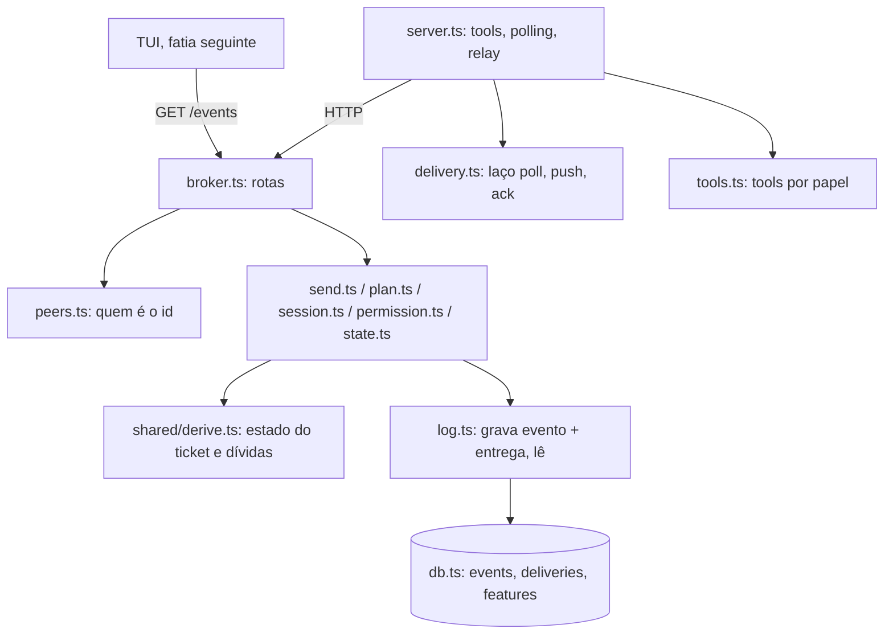

# Event Design

**Spec**: `.specs/features/event/spec.md`
**Status**: Approved

A arquitetura está decidida em `.design/squad-mvp.md` (fatia Event) e nos ADRs 002, 004, 006,
009, 010 e 011. Este documento só diz em que arquivos ela cai e o que cada um expõe.

---

## Architecture Overview

O broker continua um processo único com handlers síncronos sobre SQLite. Toda rota que grava
faz o mesmo caminho: acha o peer pelo `id`, valida, lê os eventos da feature aberta, decide
com funções puras e grava evento, entrega e `refused` numa transação.



Nenhuma regra lê tabela de ticket: `shared/derive.ts` recebe a lista de eventos da feature
aberta e devolve o estado. É a função que a TUI vai importar (ADR-006).

---

## Code Reuse Analysis

### Existing Components to Leverage

| Component | Location | How to Use |
| --------- | -------- | ---------- |
| `refuse`, `Refusal`, `ROSTER`, `Role` | `broker/peers.ts` | Importar; a forma de recusa e a lista de nomes são as mesmas |
| `appendBrokerEvent` | `broker/db.ts` | Passa a chamar o `appendEvent` genérico |
| `createPeers(db, isAlive, now)` | `broker/peers.ts` | Mesmo padrão de fábrica com relógio injetado para `createLog` e os módulos de regra |
| `setup()` | `broker/test/unit/helpers.ts` | Estender com `log`, feature aberta e os módulos de regra |
| `startBroker`, `post`, `readDb`, `waitFor` | `broker/test/integration/helpers.ts` | Estender com `get`, `openFeature(dbFile)` e leitura de `deliveries` |
| `startSession` | `broker/test/integration/server.test.ts` | Mover para `helpers.ts` para os testes novos do servidor |
| Bloco de recusa e de corpo inválido | `broker/broker.ts:48-56` | As rotas novas entram no mesmo `switch` |

### Integration Points

| System | Integration Method |
| ------ | ------------------ |
| Tabela `events` | Já tem todas as colunas; ganha índices e os gatilhos de append-only |
| Canal do Claude Code | `notifications/claude/channel` para eventos; `claude/channel/permission` declarado em `experimental`; pedido recebido por `fallbackNotificationHandler` e veredito enviado por `mcp.notification` |

---

## Components

### Contrato

- **Purpose**: Tipos do envelope, lista de kinds, arestas e conversão de linha para o formato de leitura.
- **Location**: `broker/shared/contract.ts`
- **Interfaces**:
  - `type SquadEvent` - formato de leitura, união por `kind`
  - `toRead(row: EventRow): SquadEvent` - colunas mais `data` no mesmo nível, `from_name` → `from`, `to_name` → `to`
  - `EDGES` - trios `kind`, papel de origem, papel de destino aceitos por `/send`
- **Dependencies**: nenhuma
- **Reuses**: `Role` de `peers.ts`

### Armazenamento

- **Purpose**: Schema e o único caminho de escrita em `events`.
- **Location**: `broker/db.ts`
- **Interfaces**:
  - `openDatabase(path)` - cria também `features`, `deliveries`, índices `(feature_id, ticket_ref)`, `question_id`, `gate_id`, e os gatilhos que abortam `UPDATE` e `DELETE` em `events`
  - `appendEvent(db, event): number` - grava qualquer kind e devolve o `seq`
- **Reuses**: `appendBrokerEvent` vira um caso de `appendEvent`

### Derivação

- **Purpose**: Estado dos tickets e dívidas de um peer a partir dos eventos da feature aberta.
- **Location**: `broker/shared/derive.ts`
- **Interfaces**:
  - `tickets(events: SquadEvent[]): Map<string, Ticket>` - `title`, `dropped`, `planned`, `owner`, `taskSeq`, `resultSeq`, `last`, `reworks`, `approved`
  - `owed(name, role, events, pendingSeqs): Owed[]`
- **Dependencies**: `contract.ts`. Funções puras, sem banco.

### Log

- **Purpose**: Gravar evento com a entrega e a recusa, e ler.
- **Location**: `broker/log.ts`
- **Interfaces**:
  - `createLog(db, now)`
  - `openFeature(): FeatureRow | null`, `featureEvents(): SquadEvent[]`
  - `record(event): number` - evento e, para os quatro kinds de EVT-39, a linha de `deliveries`
  - `refused(peer, attemptedKind, error, hint): Refusal` - grava `refused` e devolve a recusa
  - `pending(name)`, `ack(name, seqs)`, `after(n)`, `history(filter)`, `lastSeq()`
- **Dependencies**: `db.ts`, `contract.ts`

### Regras de envio

- **Purpose**: `/send`: envelope, aresta, regras de `task`, `result` e `verdict`.
- **Location**: `broker/send.ts`
- **Interfaces**: `createSend(log)` → `send(peer, body): { ok: true, seq } | Refusal`
- **Dependencies**: `log.ts`, `derive.ts`, `contract.ts`

### Plano

- **Location**: `broker/plan.ts`
- **Interfaces**: `createPlan(log)` → `plan(peer, body)`

### Registros da sessão

- **Location**: `broker/session.ts`
- **Interfaces**: `createSession(log)` → `blocked`, `unblocked`, `usage`, `turnStarted`

### Permissão

- **Location**: `broker/permission.ts`
- **Interfaces**: `loadHumanToken(path): string`; `createPermission(log, token)` → `request(peer, body)`, `decision(body)`

### Estado

- **Location**: `broker/state.ts`
- **Interfaces**: `createState(log)` → `state(peer): { feature, ticket, owed }`

### Registro de peers

- **Location**: `broker/peers.ts` (modify)
- **Interfaces**: `find(id): { name, role } | null`; `remove` grava `unblocked` do broker quando o peer sai bloqueado

### Rotas

- **Location**: `broker/broker.ts` (modify)
- **Interfaces**: as onze rotas com credencial, `/permission-decision` e `GET /events`

### Laço de entrega

- **Purpose**: Poll, push, ack, e veredito de permissão, com as chamadas injetadas.
- **Location**: `broker/delivery.ts`
- **Interfaces**: `createDelivery({ poll, push, ack, verdict })` → `cycle(): Promise<void>`, `remember(requestSeq, requestId)`
- **Dependencies**: `contract.ts`. Sem MCP nem HTTP: testável em unidade.

### Tools

- **Location**: `broker/tools.ts`
- **Interfaces**: `toolsFor(role): Tool[]`, `ROUTE_OF[toolName]`

### Servidor MCP

- **Location**: `broker/server.ts` (modify)
- **Interfaces**: tools do papel, laço de entrega depois do registro, relay de permissão

---

## Data Models

```sql
CREATE TABLE features (
  id INTEGER PRIMARY KEY,
  project TEXT NOT NULL,
  title TEXT NOT NULL,
  workflow TEXT NOT NULL,
  branch TEXT NOT NULL,
  base_branch TEXT NOT NULL,
  spec_ref TEXT NOT NULL,
  spec_commit TEXT NOT NULL,
  opened_seq INTEGER NOT NULL REFERENCES events(seq),
  closed_seq INTEGER REFERENCES events(seq),
  outcome TEXT
);

CREATE TABLE deliveries (
  event_seq INTEGER NOT NULL REFERENCES events(seq),
  recipient TEXT NOT NULL,
  acked_at INTEGER,
  PRIMARY KEY (event_seq, recipient)
);
```

```typescript
interface Ticket {
  ticket_ref: string;
  title: string;
  dropped: boolean;
  owner: string | null; // `to` do task mais recente
  taskSeq: number | null;
  resultSeq: number | null;
  last: { kind: "task" | "result" | "verdict"; seq: number; outcome?: "approve" | "rework" } | null;
  reworks: number;
  approved: boolean;
}

interface Owed {
  owes: "result" | "verdict" | "task" | "plan" | "delivery";
  ticket_ref?: string;
  seq: number;
}
```

---

## Error Handling Strategy

| Error Scenario | Handling | User Impact |
| -------------- | -------- | ----------- |
| Recusa de regra a peer registrado | `log.refused` grava `refused` e devolve `{ ok: false, error, hint }` | A tool devolve erro com o `hint`; a TUI ganha uma linha |
| `id` desconhecido | Recusa em `broker.ts`, antes do módulo de regra, sem `refused` | `unknown_peer` |
| Exceção dentro da transação | A transação desfaz evento e entrega; a rota responde 500 como hoje | Nada gravado |
| Push pelo canal falha | `delivery.cycle` para o ciclo sem ack | O evento volta no ciclo seguinte |
| Ack falha depois do push | `delivery` guarda o `seq` como já empurrado e só confirma de novo | Sem push repetido no mesmo processo |
| Broker fora do ar no polling | O ciclo falha e o seguinte tenta de novo | Nenhum |

---

## Risks & Concerns

| Concern | Location (file:line) | Impact | Mitigation |
| ------- | -------------------- | ------ | ---------- |
| `server.ts` concentra handshake, tools e agora entrega | `broker/server.ts:211` | Arquivo grande e só testável com processo real | O laço vai para `delivery.ts` e as definições para `tools.ts`, os dois com teste de unidade |
| `events` declara chaves para `features`, `questions` e `gates` sem `PRAGMA foreign_keys` | `broker/db.ts:34` | Um `feature_id` inexistente é aceito | O `feature_id` só vem de `log.openFeature()`; ligar o pragma fica para a fatia que criar as três tabelas |
| Os eventos da feature aberta são relidos a cada envio | `broker/log.ts` (novo) | Custo linear no tamanho da feature | Índice em `feature_id`; uma feature tem centenas de eventos, não milhões |
| Teste de integração escreve em `features` com o broker rodando | `broker/test/integration/helpers.ts:69` | Dois escritores no mesmo arquivo | WAL e `busy_timeout` já estão ligados; a escrita é uma linha antes do primeiro envio |
| Nenhuma sessão real do Claude Code nos testes | `broker/test/integration/server.test.ts:41` | Push e veredito de permissão só vistos por cliente de teste | Fica em "Não verificado" do `STATE.md`, como na Peer |
| A credencial humana é legível por qualquer processo do usuário | `broker/permission.ts` (novo) | Um agente com shell aprova o próprio pedido | Limite cooperativo já aceito no ADR-008 e no ADR-011; modo `0600` onde o sistema respeita |

---

## Tech Decisions

| Decision | Choice | Rationale |
| -------- | ------ | --------- |
| Como receber o pedido de permissão no servidor MCP | `fallbackNotificationHandler` conferindo o `method` | `setNotificationHandler` pede um schema zod, e zod não é dependência direta do projeto |
| Onde fica o laço de entrega | Módulo próprio com `poll`, `push`, `ack` e `verdict` injetados | Falha de push e de ack não se reproduz com processo real |
| Estado do ticket | Recalculado dos eventos a cada chamada | ADR-002: sem segunda fonte para divergir; o reinício do broker não muda nada (EVT-78) |
| Append-only | Gatilhos `BEFORE UPDATE` e `BEFORE DELETE` com `RAISE(ABORT)` | Vale para qualquer conexão, inclusive fora do broker |
