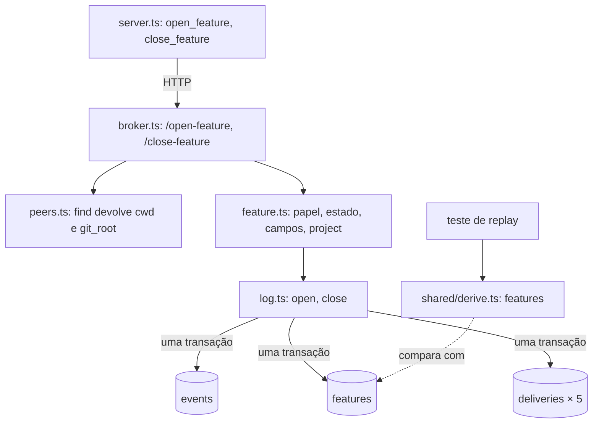

# Feature Design

**Spec**: `.specs/features/feature/spec.md`
**Status**: Approved

A arquitetura é a da Event (`.specs/features/event/design.md`). Esta fatia acrescenta um
módulo de regra, duas escritas no log, uma função de derivação, um índice e duas tools.
`send.ts`, `plan.ts`, `state.ts`, `session.ts`, `permission.ts`, `delivery.ts` e
`shared/contract.ts` não mudam: já leem a feature aberta por `log.openFeature()`, e os tipos
de `feature_opened` e `feature_closed` já estão no contrato.

---

## Architecture Overview



### O ciclo `features.opened_seq` ↔ `events.feature_id`

O `feature_opened` precisa do `id` da feature, a linha de `features` precisa do `seq` do
evento, e `events` não aceita `UPDATE`. Uma das duas pontas tem de ser conhecida antes de
gravar. A escolha:

1. Reservar o `id`: `SELECT COALESCE(MAX(feature_id), 0) + 1 FROM events`.
2. Gravar o `feature_opened` com esse `feature_id`. O `seq` volta do `INSERT`.
3. Gravar a linha de `features` com `id` explícito e `opened_seq` igual a esse `seq`.
4. Gravar as cinco entregas.

Tudo em uma transação de `log.open`. O broker é o único escritor e os handlers são
síncronos, então o `id` reservado no passo 1 ainda está livre no passo 3; se não estiver, a
chave primária aborta a transação e nada fica gravado.

O `id` sai do log e não de `features` porque `events` é append-only: mesmo que alguém apague
uma linha de `features`, um `id` já citado em algum evento nunca é dado a outra feature
(FEAT-12). O índice `events_feature_ticket` já começa por `feature_id`, e o `MAX` o usa.

Fechar não tem ciclo: `log.close` grava o `feature_closed` enquanto a feature ainda é a
aberta (o `feature_id` sai de `openFeature()` como em todo evento), e só depois faz o
`UPDATE` de `closed_seq` e `outcome` em `features`, que é mutável.

Alternativas descartadas:

| Alternativa | Por que não |
| ----------- | ----------- |
| Linha primeiro com `opened_seq` provisório, evento, depois `UPDATE` da linha | Três escritas em vez de duas, e a linha passa por um estado que o replay não reconhece |
| Prever o `seq` lendo `sqlite_sequence` e gravar a linha primeiro | Depende de detalhe do `AUTOINCREMENT`; reservar o `id` usa só `MAX` |
| `feature_id` nulo no `feature_opened`, com o `id` em `data` | Contraria "`feature_id` em todos" e FEAT-01 |

`PRAGMA foreign_keys` continua desligado (conferido: `0` no bun 1.4.2). Com ele ligado
qualquer ordem falha, porque as duas chaves se referem uma à outra e nenhuma é `DEFERRABLE`.
Esta fatia não liga o pragma.

---

## Code Reuse Analysis

### Existing Components to Leverage

| Component | Location | How to Use |
| --------- | -------- | ---------- |
| `log.refused`, `log.openFeature`, `log.record` | `broker/log.ts` | As recusas das duas rotas e o `feature_id` do `refused` de `feature_already_open` saem daqui sem código novo |
| `isText`, `Caller`, `Answer` | `broker/send.ts` | Validação dos seis campos e forma da resposta |
| `ROSTER` | `broker/peers.ts` | Os outros cinco são `ROSTER` menos o autor |
| `createPlan(log)` | `broker/plan.ts` | Mesmo formato de módulo de regra: papel, estado, campos, grava |
| `toPush` | `broker/delivery.ts` | Já põe os campos do kind no `content` e o `kind` no `meta`; FEAT-33 não pede mudança no laço |
| `win32.basename`, `win32.dirname` | `node:path` | `project`: aceitam `/` e `\`, e o `git_root` vem com `/` e o `cwd` com `\` no Windows |
| `setup()`, `refusedWith` | `broker/test/unit/helpers.ts` | Ganha `feature`; `openFeature` e `closeFeature` passam a chamar a regra |
| `startBroker`, `post`, `startSession` | `broker/test/integration/helpers.ts` | `openFeature` passa a chamar a rota |

### Integration Points

| System | Integration Method |
| ------ | ------------------ |
| Tabela `features` | Sem coluna nova. Ganha o índice único parcial, criado com `IF NOT EXISTS` a cada `openDatabase` |
| Tabela `deliveries` | Cinco linhas por evento com `to_name` `*` |
| `GET /events` | Sem mudança; é a entrada do replay |

---

## Components

### Armazenamento

- **Location**: `broker/db.ts` (modify)
- **Interfaces**: `openDatabase` cria também
  `CREATE UNIQUE INDEX IF NOT EXISTS features_one_open ON features ((1)) WHERE closed_seq IS NULL`
- Conferido no bun: o segundo `INSERT` aberto, e o `UPDATE` que reabre uma fechada com outra aberta, abortam com `UNIQUE constraint failed` (FEAT-09). Sobre um banco da Event o índice é criado na subida seguinte.

### Log

- **Location**: `broker/log.ts` (modify)
- **Interfaces**:
  - `open(by: Caller, project: string, fields: FeatureFields): { feature_id: number; seq: number }` - os quatro passos acima, em uma transação (FEAT-01, 07, 08, 12)
  - `close(by: Caller, outcome: string, body: string): number` - `feature_closed`, cinco entregas e o `UPDATE` da linha, em uma transação (FEAT-14, 21, 22)
  - `record` - sem mudança de assinatura. Por dentro, o `feature_id` pode vir de quem chama (só `open` usa), e um evento com `to` `*` ganha uma entrega para cada nome de `ROSTER` que não é o autor
- **Dependencies**: `db.ts`, `peers.ts` (`ROSTER`)
- A regra de entrega fica em um lugar só: `to` `*` → os outros cinco; os quatro kinds de `DELIVERED` → o `to`.

### Regras de feature

- **Purpose**: `/open-feature` e `/close-feature`: papel, estado, campos, `project`.
- **Location**: `broker/feature.ts` (novo)
- **Interfaces**:
  - `createFeature(log)` → `open(peer, body)`, `close(peer, body)`
  - `open(peer: Caller & Where, body): { ok: true; feature_id: number; seq: number } | Refusal` - ordem de FEAT-06; `refused` com `attempted_kind` `feature_opened`
  - `close(peer: Caller, body): Answer` - ordem de FEAT-19; `refused` com `attempted_kind` `feature_closed`; nenhuma leitura de gate (FEAT-23)
  - `projectOf(git_root: string | null, cwd: string): string` - exportada, pura (FEAT-11)
  - `type Where = { cwd: string; git_root: string | null }`
- **Dependencies**: `log.ts`, `send.ts` (`isText`, `Caller`, `Answer`)
- `data` do `feature_opened` é montado campo a campo com os seis: nada do corpo passa junto.

### Registro de peers

- **Location**: `broker/peers.ts` (modify)
- **Interfaces**: `find(id)` passa a devolver `{ name, role, cwd, git_root }`. Os outros módulos continuam recebendo `Caller`; só `feature.open` lê os dois campos novos.

### Derivação

- **Location**: `broker/shared/derive.ts` (modify)
- **Interfaces**: `features(events: SquadEvent[]): DerivedFeature[]` - pura, em ordem crescente de `id`; recebe o log inteiro, não só a feature aberta (FEAT-26)

### Rotas

- **Location**: `broker/broker.ts` (modify)
- **Interfaces**: `/open-feature` e `/close-feature` entram em `CREDENTIAL_ROUTES` e no `switch` de `answer`. `unknown_peer` já sai antes do módulo, sem `refused`.

### Tools

- **Location**: `broker/tools.ts` (modify)
- **Interfaces**: `open_feature` (os seis campos, todos `required`; `workflow` com `enum`) e `close_feature` (`outcome` com `enum`, `body` opcional) em `OF_ROLE.mother`; as duas em `ROUTE_OF` (FEAT-29)

### Servidor MCP

- **Location**: `broker/server.ts` (modify)
- **Interfaces**:
  - Texto de sucesso: resposta com `feature_id` numérico vira `Feature <feature_id> opened with seq <seq>.`; as outras continuam `Recorded with seq <seq>.` (FEAT-30, 31). Recusa já sai pelo caminho comum (FEAT-32)
  - As instruções do servidor passam a citar `feature_opened` e `feature_closed` entre os kinds que chegam pelo canal

### Helpers de teste

- **Location**: `broker/test/unit/helpers.ts`, `broker/test/integration/helpers.ts` (modify)
- **Unidade**: `setup()` cria `feature = createFeature(log)`. `openFeature(fields)` chama `feature.open` como `mother` e devolve o `feature_id`; `closeFeature()` chama `feature.close` com `delivered`. Somem os parâmetros `project` e `opened_seq`, que a regra calcula. Nenhum `INSERT` ou `UPDATE` em `features` sobra nos helpers.
- **Integração**: `openFeature(url, motherId)` faz `POST /open-feature` e devolve o `feature_id`. O teste que ainda não tem mother registra uma por `/register`. O `UPDATE features SET closed_seq` de `routes.test.ts:372` vira `POST /close-feature`.
- **O que isso desloca**: cada abertura passa a custar um `seq` e cinco entregas pendentes, e cada encerramento idem. Medido com o helper de unidade simulado: 74 dos 305 testes de unidade falham (`log` 16, `send` 10, `send-task` 10, `plan` 8, `send-result` 8, `send-verdict` 6, `session` 5, `presence` 4, `state` 4, `permission` 3). Confirmar as cinco entregas dentro do helper só salva 4, então o helper não confirma nada. As falhas são `seq` literal, log inteiro comparado, lista de `deliveries` e dívida de `delivery` em `/state`.
- **Como migrar sem suíte vermelha**: o helper novo entra com outro nome ao lado do antigo, os arquivos de teste migram um por tarefa, e a última tarefa apaga o antigo e renomeia. Vale para unidade e integração.

---

## Data Models

```sql
CREATE UNIQUE INDEX IF NOT EXISTS features_one_open ON features ((1)) WHERE closed_seq IS NULL;
```

```typescript
// log.ts: o que a mother manda, já validado
interface FeatureFields {
  title: string;
  workflow: string;
  branch: string;
  base_branch: string;
  spec_ref: string;
  spec_commit: string;
}

// shared/derive.ts: uma linha de `features` sem `project`
interface DerivedFeature extends FeatureFields {
  id: number;
  opened_seq: number;
  closed_seq: number | null;
  outcome: string | null;
}
```

---

## Error Handling Strategy

| Error Scenario | Handling | User Impact |
| -------------- | -------- | ----------- |
| Recusa de regra à mother ou a outro papel | `log.refused` com `feature_opened` ou `feature_closed` | A tool devolve erro com `error` e `hint` |
| Falha ao gravar a linha de `features` ou uma entrega | A transação de `log.open` / `log.close` desfaz o evento; a rota responde 500 | Nada gravado (FEAT-08, FEAT-21) |
| Segunda feature aberta por fora do broker | O índice aborta o comando | Erro do SQLite em quem tentou |
| Banco antigo já com duas linhas abertas | `CREATE UNIQUE INDEX` falha e o broker não sobe | Só um banco de teste da Event chega a esse estado; apagar o arquivo |

FEAT-08 e FEAT-21 são testados em unidade com um gatilho temporário que aborta o `INSERT` em
`features` ou em `deliveries`.

---

## Risks & Concerns

| Concern | Location (file:line) | Impact | Mitigation |
| ------- | -------------------- | ------ | ---------- |
| 120 chamadas de `openFeature` nos testes de unidade dependem da linha sem evento | `broker/test/unit/helpers.ts:56` | 74 testes falham ao trocar o helper | Migração arquivo a arquivo com os dois helpers lado a lado |
| 30 chamadas na integração escrevem no arquivo do broker em execução | `broker/test/integration/helpers.ts:116` | Passam a precisar de mother registrada e de `await`; os testes de canal recebem um `feature_opened` a mais em `pushed()` | Mesma migração; o custo não foi medido, só contado |
| A consulta da feature aberta está duplicada fora do log | `broker/peers.ts:94` | Uma mudança na definição de "aberta" teria dois lugares | A definição não muda nesta fatia; o índice a torna regra do banco. Fica como está |
| Chaves estrangeiras declaradas e não aplicadas, agora com ciclo | `broker/db.ts:35`, `broker/db.ts:60` | Ligar o pragma depois exige recriar uma das tabelas com `DEFERRABLE` | Não ligar nesta fatia; anotado aqui para quem for ligar |
| `features` não tem gatilho contra `DELETE` | `broker/db.ts:51` | Linha apagada por fora diverge do log | O `id` vem de `events`, então não é reusado; o teste de replay acusa a divergência |
| `project` vazio quando o `cwd` é a raiz do disco e não há repositório | `broker/feature.ts` (novo) | Cabeçalho da TUI sem nome de projeto | Aceito: a coluna é `NOT NULL` e texto vazio passa; a spec não pede outro valor |
| Um nome nunca lançado acumula duas entregas por feature | `broker/log.ts:76` | `worker-3` recebe todas ao subir | Custo já aceito na spec |

---

## Tech Decisions

| Decision | Choice | Rationale |
| -------- | ------ | --------- |
| Ordem de gravação na abertura | `id` reservado, evento, linha | Duas escritas, e a linha nunca existe sem o seu `opened_seq` |
| De onde vem o `id` | `MAX(feature_id)` de `events` | Append-only: nunca reusado |
| Onde ficam as escritas em `features` | `log.ts` | Já é dono de `openFeature()` e da transação evento + entrega; os módulos de regra continuam sem ver o banco |
| Quem recebe um evento `*` | Decidido por `to === "*"`, não por lista de kinds | Só os dois kinds desta fatia têm `to` `*` no contrato |
| Como `feature.open` conhece o `git_root` | `peers.find` devolve os dois campos a mais | Uma consulta alterada; nenhum outro módulo muda de assinatura |
| Expressão do índice | `((1))` com `WHERE closed_seq IS NULL` | Toda linha aberta cai na mesma chave |
| Helper de unidade confirma as entregas da abertura? | Não | Medido: salva 4 de 74 testes e esconde entregas que o broker real deixa pendentes |
