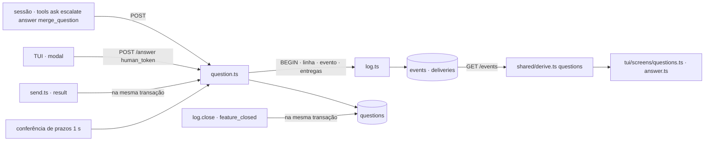

# Question Design

**Spec**: `.specs/features/question/spec.md`
**Status**: Approved

A fatia já decide o contrato, a tabela e os dois diagramas. Este documento diz onde cada
peça fica, o que muda nos módulos que já existem e como a TUI passa a escrever.

---

## Architecture Overview



Duas metades que só se encontram em `POST /answer` e em `GET /events`:

1. **Broker.** `question.ts` é um módulo de rota, como `send.ts` e `feature.ts`. Ele decide
   pela tabela `questions`, que é a máquina de estados da fatia, e grava linha, evento e
   entregas numa transação. A tabela não é lida por ninguém fora dele e de `log.close`.
2. **Tela.** A derivação ganha os campos que a aba mostra; a aba e o modal são funções
   puras de `View`; o redutor de teclas continua puro e deixa em `Ui` o envio a fazer; o
   laço de `tui.ts` faz o `POST` e devolve o resultado ao redutor.

A tabela e a derivação nunca se consultam: o teste de paridade (QST-48) é o que as mantém
iguais.

---

## Code Reuse Analysis

### Existing Components to Leverage

| Component | Location | How to Use |
| --------- | -------- | ---------- |
| `createLog`, `record`, `refused`, `transaction`, `after`, `openFeature` | `broker/log.ts` | Caminho único de escrita de evento e entrega; `record` ganha `question_id` e `recipients` |
| `refuse`, `ROSTER`, `Role` | `broker/peers.ts` | Recusas e os seis nomes |
| `isText`, `SUMMARY_MAX`, `Answer`, `Caller` | `broker/send.ts` | Validação de campo e formato das respostas |
| `loadHumanToken`, a forma de `permission.decision` | `broker/permission.ts` | O caminho do dev em `/answer` é o mesmo: token, sem `refused` |
| `tokenPath` | `broker/shared/config.ts` | A TUI lê o mesmo arquivo que o broker |
| `questions`, `Question`, `owed`, `squad` | `broker/shared/derive.ts` | Estendidas, sem mudar o que já devolvem |
| `qid` | `broker/tui/feed.ts` | Vai para `shared/contract.ts`; o broker escreve `Q-NN` no `summary` do `answer` |
| `grid`, `wrap`, `cut`, `pad`, `mmss`, `age`, `clock` | `broker/tui/grid.ts` | Primitivas de desenho; `dim()` sem argumentos escurece a tela inteira |
| `chrome`, `stats`, `drawKeys`, `drawRows`, `tone`, `segLen`, `Line` | `broker/tui/screens/chrome.ts` | Linhas 0, 1, 38 e 39 e as linhas dos painéis |
| `label` | `broker/tui/feed.ts` | Rótulos curtos da rota |
| `createReader` | `broker/tui/reader.ts` | Modelo do `createWriter`: `fetch` injetado e tempo esgotado próprio |
| `setup` | `broker/test/unit/helpers.ts` | Broker em memória com relógio fixo; ganha o módulo novo |
| `frame`, `frameView`, `expected`, `DEVIATIONS`, `LOGS` | `broker/test/frames/` | Teste de frames do AD-010 |
| `rQs`, `qDetailRows`, `histRow`, `qModal`, `drawModal`, `drawInput`, `routeSegs`, `openQs`, `qAge`, `qLeft` | `Squad TUI.dc.html` (protótipo) | Portadas: mesmas coordenadas, cortes e cores, com o estado derivado no lugar de `QS` e `hist` |

### Integration Points

| System | Integration Method |
| ------ | ------------------ |
| `broker.ts` | `/ask`, `/escalate`, `/merge-question` entram em `CREDENTIAL_ROUTES`; `/answer` entra em `ROUTES` e é despachada antes, como `/permission-decision`: com a chave `human_token` vai ao caminho do dev, senão procura o peer do `id`. A conferência de prazos roda uma vez antes de `Bun.serve` e depois em `setInterval` de 1000 ms |
| `send.ts` | `createSend(log, afterResult?)`: chamado dentro da transação do `result` de worker, depois do `unblocked` |
| `log.ts` | `close` fecha as perguntas da feature na transação do `feature_closed` |
| `state.ts` | Sem mudança: a dívida de `answer` passa a sair de `owed()` |
| `tools.ts`, `server.ts` | Quatro tools e quatro entradas em `ROUTE_OF`; o despacho genérico do servidor já devolve a resposta do broker |
| `tui.ts` | Tela nova em `SCREENS`, modal por cima, `io.token`, e o envio depois de cada redução |

---

## Components

### Tabela `questions`

- **Purpose**: A máquina de estados da pergunta.
- **Location**: `broker/db.ts`
- **Interfaces**: `CREATE TABLE IF NOT EXISTS questions` com as doze colunas da fatia; `status` é `open`, `answered`, `defaulted`, `merged` ou `discarded`. `QuestionRow` exportado.
- **Notes**: `id INTEGER PRIMARY KEY` sem `AUTOINCREMENT`: o id novo é `MAX(id) + 1`, e nenhuma linha é apagada (QST-45), então nenhum id é reusado.

### Log

- **Location**: `broker/log.ts`
- **Interfaces**:
  - `NewRecord.question_id?: number` — vai para a coluna `question_id`. Quem grava põe o mesmo valor em `data`, que é o formato de leitura.
  - `NewRecord.recipients?: string[]` — quando presente, são essas as entregas, e a regra por kind de `write` não se aplica. `question` e `answer` sempre o passam.
  - `close(by, outcome, body)` — depois de fechar a linha de `features`, `UPDATE questions SET status = CASE WHEN default_answer IS NOT NULL THEN 'defaulted' ELSE 'discarded' END WHERE feature_id = ? AND status IN ('open', 'merged')`.
- **Notes**: `DELIVERED` não muda. O `ts` de um evento recém-gravado é lido com `log.after(seq - 1)[0]`, como `permission.ts` já faz: o `deadline_ts` sai do `ts` gravado, não de uma segunda leitura do relógio.

### Rotas de pergunta

- **Purpose**: `/ask`, `/escalate`, `/merge-question`, `/answer`, o prazo e o default pelo `result`.
- **Location**: `broker/question.ts`
- **Interfaces**: `createQuestion(db, log, token, now = Date.now)` devolve
  - `ask(peer, body)` → `{ ok: true, question_id, seq } | Refusal`
  - `escalate(peer, body)`, `merge(peer, body)` → `Answer`
  - `answer(peer, body)` — holder agente, grava `refused` nas recusas
  - `answerAsHuman(body)` — confere o token primeiro; nenhuma recusa grava evento
  - `expire()` → os `seq` gravados: fecha por `timeout_default` toda linha `open` com `deadline_ts <= now()`
  - `delivered(worker, ticket_ref)` — o default pelo `result`; chamado por `send.ts` dentro da transação
- **Dependencies**: `db` para a tabela, `log` para eventos e entregas.
- **Notes**:
  - Uma função interna `resolve(row, event, status)` é o único lugar que fecha por `answer`: dentro de `log.transaction`, relê a linha, devolve `question_closed` se não estiver `open` (ou `merged`, no caso de `delivered`), grava o `answer` com os destinatários, atualiza a linha e as mescladas dela. `answer`, `answerAsHuman`, `expire` e `delivered` passam por ela (QST-38, QST-41).
  - As mescladas de uma pergunta saem de uma consulta recursiva (`WITH RECURSIVE`) sobre `merged_into` com `status = 'merged'`.
  - `NEXT: Record<Role, string>` dá o nível de cima; `ASK_EDGES` lista os cinco pares.
  - Em `/escalate` os campos copiados vêm do primeiro `question` da pergunta, lido com `log.history({ question_id })`; `summary` e `body` ausentes vêm do último.

### Derivação

- **Location**: `broker/shared/derive.ts`
- **Interfaces**: `Question` ganha `text`, `why`, `options: string[]`, `timeout_s: number | null`, `status`, `answer_seq: number | null`, `answered_by: string | null`, `closed_ts: number | null` (o `ts` do `answer` próprio, ou o do `question_merged` sem ele), `absorbed: number[]` (ids das mescladas diretas, em ordem). `questions(events)` passa a ler o `feature_closed`. `owed()` passa a devolver a dívida de `answer` do holder; `squad` deixa de somá-la por fora.
- **Notes**: os campos antigos não mudam de sentido. `open` é `status === "open"`. `squad` continua passando só os eventos da feature aberta, então nenhuma tela vê `discarded`; quem vê é o teste de paridade, que passa os eventos de cada feature.

### Tools

- **Location**: `broker/tools.ts`
- **Interfaces**: `ASK_TOOL`, `ANSWER_TOOL`, `ESCALATE_TOOL`, `MERGE_QUESTION_TOOL`; `OF_ROLE` ganha `ask` nos quatro papéis, `answer` e `escalate` em worker, leader e mother, `merge_question` na mother; `ROUTE_OF` ganha as quatro rotas, sem `kind`.

### Perguntas da tela

- **Purpose**: O que a aba, o modal e as teclas precisam saber das perguntas, num lugar só.
- **Location**: `broker/tui/asked.ts`
- **Interfaces**: `waiting(squad): Question[]` (a lista, na ordem de QST-55); `resolved(squad): Question[]` (o histórico, na ordem de QST-60); `effect(q, squad): string` (QST-59); `outcome(q, squad): Seg[]` (QST-61); `left(q, now): number` (segundos até o prazo, nunca negativo).

### Tela de perguntas

- **Location**: `broker/tui/screens/questions.ts`
- **Interfaces**: `questions(view): Grid`. Porta `rQs`, `qDetailRows` e `histRow`: caixa da lista em (0, 2) 60×24, detalhe em (60, 2) 60×24, histórico em (0, 26) 120×12.

### Modal de resposta

- **Location**: `broker/tui/screens/answer.ts`
- **Interfaces**: `answer(g, view)`: escurece `g` e desenha o modal de `view.ui.modal` por cima, com a linha 39 do modo. Porta `qModal`, `drawModal` e `drawInput`: caixa em x 19, largura 82, centrada na altura.

### Estado da tela e teclas

- **Location**: `broker/tui/view.ts`, `broker/tui/keys.ts`
- **Interfaces**:
  - `Ui.screen` ganha `"questions"`; `Ui.question: number | null` (id selecionado); `Ui.qfocus: "list" | "history"`; `Ui.historyOffset: number`; `Ui.modal: Modal | null`; `Ui.send: { question_id: number; answer: string } | null`.
  - `Modal = { question: number; choice: number | null; text: string; expanded: boolean; sending: boolean; refused: boolean }` — `choice` nulo é o modo texto.
  - `press(ui, key, view)` — com `ui.modal` as teclas são do modal; `enter` com o que enviar devolve `modal.sending` verdadeiro e `send` preenchido.
  - `settle(ui, result, view)` — o que o resultado do `POST` faz: fecha com o aviso, passa a `refused`, ou devolve o modal ao texto com o aviso do erro. Sempre zera `send`.
  - `sync(ui, view)` — depois de cada leitura: seleção por id (QST-68), modal de pergunta fechada (QST-82), deslocamento do histórico dentro do limite.
  - `keysOf(chunk, ui)` — as teclas de um bloco de entrada; no modo texto, num bloco de mais de uma tecla, `\r` e `\n` viram espaço (QST-78).
- **Notes**: `press` continua pura e sem relógio próprio. `backspace` é `\x7f` e `\x08`; `ctrl+e` é `\x05`; `ctrl+u` é `\x15`.

### Escrita

- **Location**: `broker/tui/writer.ts`
- **Interfaces**: `createWriter({ fetch, url, timeoutMs = 2000 })` → `answer(token, question_id, answer): Promise<{ ok: true } | { ok: false; error: string }>`. É o único `POST` da TUI (QST-86). Falha de transporte, status que não é 200 e corpo fora do formato viram `error` `broker não respondeu`.

### Processo

- **Location**: `broker/tui.ts`
- **Interfaces**: `Io.token: () => string | null` (lê o arquivo de `tokenPath()`, nulo se não existe ou está vazio); `Settings` não muda. Depois de reduzir as teclas, se `ui.send` existe o laço lê o token, chama o writer e aplica `settle`; `tick` aplica `sync` depois de cada leitura. O desenho é `SCREENS[ui.screen](view)` e, com `ui.modal`, `answer(g, view)` por cima.

### Frames

- **Location**: `broker/test/frames/`
- **Interfaces**: seis arquivos novos (`04`, `05`, `06`, `07`, `20a`, `20b`); `FrameLog` ganha `ui?: Partial<Ui>` e `frameView` o aplica; `MAIN` e `ERR_X` ganham `body`, `why` e `options` nas perguntas, como o protótipo os tem em `QS`; a tabela de desvios perde as quatro linhas de Question do frame 11 e ganha os desvios dos frames novos.

### Demo

- **Location**: `broker/tui/demo.ts`
- **Interfaces**: o servidor do demo aceita `POST /answer`: acrescenta ao log em memória o `answer` do dev e responde `{ ok: true, seq }`, ou `question_closed` se a pergunta já tem `answer`. Sobe a TUI com um `SQUAD_TOKEN_FILE` temporário. É o que deixa o dev ver o modal num terminal real sem broker.

---

## Data Models

### Linha de `questions`

```typescript
interface QuestionRow {
  id: number;
  feature_id: number;
  ticket_ref: string | null;
  asked_by: string;
  holder: string; // nome do peer, ou "human"
  blocking: 0 | 1;
  default_answer: string | null;
  timeout_s: number | null;
  deadline_ts: number | null; // só não-bloqueante que chegou ao dev
  status: "open" | "answered" | "defaulted" | "merged" | "discarded";
  merged_into: number | null;
  answer_seq: number | null;
}
```

**Relationships**: `feature_id` → `features.id`; `merged_into` → `questions.id`; `answer_seq` → `events.seq`; `events.question_id` → `questions.id`.

### Transições

| De | Evento | Para | Quem grava |
| -- | ------ | ---- | ---------- |
| - | `/ask` | `open` | `ask` |
| `open` | `/escalate` | `open`, holder novo | `escalate` |
| `open` | `/answer` do holder ou do dev | `answered` | `resolve` |
| `open` | prazo | `defaulted` | `expire` → `resolve` |
| `open`, `merged` | `result` do `asked_by` no ticket | `defaulted` | `delivered` → `resolve` |
| `open` | `/merge-question` | `merged` | `merge` |
| `merged` | a de destino ganha `answer` | o status da de destino | `resolve` |
| `open`, `merged` | `feature_closed` | `defaulted` ou `discarded` | `log.close` |

---

## Error Handling Strategy

| Error Scenario | Handling | User Impact |
| -------------- | -------- | ----------- |
| Recusa a um peer em qualquer rota da fatia | `log.refused` com o kind tentado; nada mais gravado | Linha de `refused` no feed; o agente lê `error` e `hint` |
| Recusa ao dev em `/answer` | `refuse`, sem evento | Aviso no rodapé, ou o estado recusado do modal em `question_closed` |
| Falha de SQL no meio de uma gravação | A transação desfaz linha, evento e entregas; o `500` de `broker.ts` leva a mensagem | A TUI avisa `✗ resposta não enviada · broker não respondeu` |
| Resposta e prazo no mesmo instante | `resolve` relê o status dentro da transação | Quem chega depois recebe `question_closed` |
| Broker reinicia com prazo vencido | `expire()` antes de `Bun.serve` | O `answer` de default aparece na primeira leitura |
| `POST /answer` sem resposta em 2000 ms, status que não é 200 | `writer` devolve `{ ok: false, error }` | Modal mantido com o texto e aviso vermelho |
| Arquivo do token ausente ou vazio | Nenhum `POST` | Modal mantido e aviso `✗ credencial humana não encontrada` |
| Leitura mostra a pergunta do modal fechada | `sync` fecha o modal, a não ser no estado recusado | Aviso `⟳ default aplicado` ou `Q-NN fechada` |
| Broker sem responder às leituras | `press` ignora as teclas do modal e não abre um novo | Tela congelada da TUI leitura; o modal volta com o texto |

---

## Risks & Concerns

| Concern | Location (file:line) | Impact | Mitigation |
| ------- | -------------------- | ------ | ---------- |
| A entrega é decidida pelo kind, com um destinatário, o `to` | `broker/log.ts:87` | `question` para `human` ganharia uma entrega que ninguém confirma; `answer` precisa de vários destinatários | `NewRecord.recipients` explícito; a regra por kind fica para quem não o passa |
| `NewRecord` não tem `question_id` | `broker/log.ts:40`, `broker/db.ts:113` | `/history` por `question_id` não acha nada | Campo novo, passado a `appendEvent` (QST-50) |
| `questions()` só conhece `question`, `answer` e `question_merged` | `broker/shared/derive.ts:267` | Sem o `feature_closed`, a paridade com a tabela falha em toda feature fechada | QST-46 e o teste de paridade por feature |
| `press` é pura e não tem como enviar | `broker/tui/keys.ts:24`, `broker/tui.ts:122` | O envio viraria efeito dentro do redutor | `Ui.send` como comando, executado pelo laço, com `settle` puro (AD-014) |
| Com o broker fora, a tela congelada cobre qualquer tela | `broker/tui.ts:94` | Um modal aberto some e as teclas o mudariam sem o dev ver | QST-84: as teclas não mudam o modal enquanto `view.down` |
| `q`, dígitos e letras têm função global | `broker/tui/keys.ts:31` | No campo de texto, `q` sairia da TUI | O ramo do modal vem antes do `switch` global; só `ctrl+c` sai |
| Um bloco colado pode trazer `\r` | `broker/tui.ts:126` | A resposta seria enviada pela metade, e não pode ser apagada | `keysOf` (QST-78) |
| O `setup` dos testes monta os módulos à mão | `broker/test/unit/helpers.ts:83` | Sem o módulo novo, `/send` de teste não fecha perguntas | `setup` cria `question` e o passa a `createSend`, na tarefa que cria o módulo |
| Os logs dos frames têm `why` vazio e `body` de cenário | `broker/test/frames/logs.ts:61` | A aba desenhada do log não seria a do frame | `MAIN` e `ERR_X` ganham os campos de `QS`; os 41 frames de leitura são redesenhados na mesma tarefa para provar que não mudam |
| O log do frame 25b tem dois `answer` para a Q-13 | `broker/test/frames/logs.ts:260` | O broker recusaria o segundo; a derivação lê o primeiro | Fora de escopo na spec; os testes de paridade não usam logs de frame |
| Conferência de prazos a cada segundo | `broker/broker.ts` | Uma consulta por segundo | `WHERE status = 'open' AND deadline_ts <= ?` numa tabela de dezenas de linhas |

---

## Tech Decisions (only non-obvious ones)

| Decision | Choice | Rationale |
| -------- | ------ | --------- |
| Onde as regras leem o estado da pergunta | Na tabela, não na derivação | A fatia dá a tabela e os prazos "são os gravados"; o id sequencial sai dela. A derivação continua sendo a regra da tela, e o teste de paridade liga as duas |
| Quem fecha as perguntas no encerramento | `log.close`, na transação do `feature_closed` | `log.ts` já grava a linha de `features` junto do evento; `feature.ts` não ganha dependência nova (AD-012) |
| `/answer` com duas credenciais | A chave `human_token` escolhe o caminho | Um corpo com token errado não pode cair no caminho do peer e gravar `refused` em nome de alguém |
| Destinatários do `answer` | Lista explícita em `NewRecord.recipients` | O `to` do evento continua sendo um só, o `asked_by`; a entrega a mescladas e à mother não cabe no `to` |
| Envio pela TUI | Comando em `Ui.send`, `settle` puro (AD-014) | O redutor continua testável sem rede; a fatia Gate escreve do mesmo jeito |
| Texto da pergunta | Do primeiro `question` (AD-013) | Resposta do dev; a escalação copia os campos para que o holder receba a pergunta inteira |
| Seleção da aba | Por id da pergunta, não por índice | A ordem muda quando um prazo se aproxima ou uma pergunta fecha |
| Logs dos frames novos | Os mesmos de `main` e do cenário de erro, com os campos de `QS` | Um cenário, um log; o histórico ganha a pergunta que o protótipo esqueceu, como desvio D1 |
