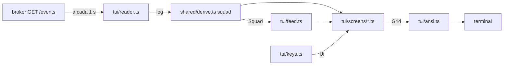

# TUI leitura Design

**Spec**: `.specs/features/tui-leitura/spec.md`
**Status**: Approved

A arquitetura já está decidida na fatia: buffer de células 120×40, cada tela uma função
pura do estado derivado, funções de desenho portadas do protótipo, sem Ink, mesmo runtime
do broker. Este documento só diz onde cada peça fica e fecha as regras que a spec deixou
para cá.

---

## Architecture Overview



Três camadas, e só a de cima toca o mundo:

1. **Derivação** (`shared/derive.ts`): `squad(events, now)` devolve o estado do squad. É a regra do contrato (ADR-006); o broker pode usá-la.
2. **Tela** (`tui/`): `feed(events, squad)` monta as linhas do feed; cada `screens/*.ts` recebe `(View)` e devolve um `Grid`. Puras.
3. **Processo** (`tui.ts`, `tui/reader.ts`, `tui/keys.ts`, `tui/ansi.ts`): lê o broker, lê teclas, escreve escapes. `fetch`, relógio e saída são injetados.

O protótipo (`Squad TUI.dc.html` dentro de `docs/claude-design-handoff/Handoff-Design.zip`)
é a fonte das funções de desenho: `Grid`, `chrome`, `stats`, `feedRow`, `detailLines`,
`rMain`, `rBrokerDown`, `node`, `edgePath`, `rTopo`, `rThread`, `rHelp`, `rSmall`,
`drawKeys`, `drawRows`, `rLine0`, `rTokStrip`. Portar quer dizer manter coordenadas,
cortes e cores, e trocar o `ctx` escrito à mão pelo estado derivado. `qModal`, `gateModal`,
`permModal`, `rQs`, `drawInput`, `drawModal`, `drawPre` não são portadas.

---

## Code Reuse Analysis

### Existing Components to Leverage

| Component | Location | How to Use |
| --------- | -------- | ---------- |
| `tickets`, `owed`, `features`, `REWORK_LIMIT` | `broker/shared/derive.ts` | Base da derivação nova; `squad` chama as três |
| `SquadEvent`, `Kind`, `Criterion` | `broker/shared/contract.ts` | Tipo de entrada de tudo |
| `brokerUrl`, `pollIntervalMs` | `broker/shared/config.ts` | Endereço e intervalo de leitura |
| `projectOf` | `broker/feature.ts` | Nome do projeto a partir do git common dir |
| `getGitRoot` | `broker/shared/git.ts` | Git common dir do diretório da TUI |
| Helpers de teste de integração | `broker/test/integration/helpers.ts` | Subir o broker real com `SQUAD_DB` e `SQUAD_TOKEN_FILE` temporários |
| Frames extraídos | `broker/test/frames/*.txt` | Texto esperado de cada frame |

### Integration Points

| System | Integration Method |
| ------ | ------------------ |
| Broker | `GET /events?after=<seq>` → `{ events, last_seq }`. Nenhuma outra chamada |
| `shared/derive.ts` | Funções novas no mesmo arquivo; as existentes não mudam de assinatura |

---

## Components

### Derivação do squad

- **Purpose**: O estado de agentes, tickets, perguntas, gates, permissões e tokens, só dos eventos.
- **Location**: `broker/shared/derive.ts`
- **Interfaces**:
  - `SQUAD: { name; role; short }[]` — os seis, na ordem `mother`, `leader`, `worker-1`..`3`, `judge`, com `short` `mot`, `ldr`, `w1`, `w2`, `w3`, `jdg`.
  - `presence(events): Map<name, { online: boolean; since: number; joins: number }>` — sem entrada para quem nunca teve evento de presença.
  - `openPermissions(events): SquadEvent[]` — pedidos abertos, em ordem de `seq`.
  - `questions(events): Question[]` — `{ id, asked_by, holder, blocking, ticket_ref, open, merged_into, default, deadline, reached_human_ts, route, resolved_by, answer, first_seq, last_seq }`. `events` são os da feature aberta.
  - `gates(events): Gate[]` — `{ id, pending, request_seq, decision }`.
  - `ticketStatus(events, agents?)` é interno; o público é `squad`.
  - `usageTotals(events, sinceSeq?): Map<name, Record<model, { input; output; cache_write; cache_read }>>`.
  - `squad(events, now): Squad`.
- **Dependencies**: nenhuma além de `contract.ts`.
- **Reuses**: `tickets`, `owed`, `features`.

### Grade

- **Purpose**: O buffer de células e as primitivas de desenho.
- **Location**: `broker/tui/grid.ts`
- **Interfaces**: `grid(w = 120, h = 40): Grid` com `put`, `segs`, `bg`, `clear`, `box`, `sep`, `dim`, `rows` (células) e `text(): string[]` (linhas sem espaço à direita); `len`, `cut` (o `tr` do protótipo), `pad`, `wrap`, `mmss`, `age` (`ageS`), `clock(ts)` (`HH:MM:SS` local).
- **Reuses**: porta `Grid`, `L`, `tr`, `pad`, `wrap`, `mmss`, `ageS` do protótipo. `g.lines` e `toEl` (DOM) não são portadas.

### Saída ANSI

- **Purpose**: Transformar um `Grid` nos escapes que mudam o terminal.
- **Location**: `broker/tui/ansi.ts`
- **Interfaces**: `paint(next: Grid, prev: Grid | null, glyphs: Map<string, string>): string` (só as linhas que mudaram); `parseGlyphs(text | undefined): Map<string, string>` (lança com o par inválido); `ENTER`, `LEAVE` (tela alternativa, cursor).
- **Notes**: as 16 cores do protótipo (`P`) viram SGR 30–37 e 90–97, fundo 40–47 e 100–107; `gray` é 90, `bg` (texto na cor do fundo, usado na aba ativa) é 30.

### Configuração da TUI

- **Purpose**: Tabela de preços e intervalo de leitura.
- **Location**: `broker/tui/config.ts`, `broker/tui/prices.json`
- **Interfaces**: `prices(env): PriceTable` (lança com o caminho inválido); `readIntervalMs(env): number`; `cost(totals, table): number`.

### Feed

- **Purpose**: As linhas do feed a partir do log.
- **Location**: `broker/tui/feed.ts`
- **Interfaces**: `feed(events, now): FeedRow[]`, com `FeedRow = { seq; ts; event; sys?: SysKind; text; count?; lastTs?; ... }`. Uma linha por evento que tem linha, mais a linha sintética de limite de rework.
- **Notes**: a linha de `stalled` (TUI-25) chama `squad(prefixo, ts)` para cada `usage`. `// ponytail: O(usage × n); guardar as linhas já calculadas por seq quando o log passar de alguns milhares de eventos`.

### Telas

- **Purpose**: Uma função pura por tela.
- **Location**: `broker/tui/screens/chrome.ts` (linha 0, abas, selos, teclas, rodapé de tokens), `main.ts` (agentes, tickets, feed, detalhe), `detail.ts` (blocos do painel de detalhe), `topology.ts`, `thread.ts`, `help.ts`, `small.ts`, `down.ts`; `broker/tui/activity.ts` (texto de atividade, selos e lado direito do rodapé).
- **Interfaces**: `main(view): Grid`, `topology(view): Grid`, `thread(view): Grid`, `help(view): Grid`, `small(cols, rows): Grid`, `down(view): Grid`.

### Leitura, teclas e entrada

- **Location**: `broker/tui/reader.ts` (`createReader({ fetch, url })` → `poll(): Promise<{ ok; events }>` com cursor e reinício), `broker/tui/keys.ts` (`press(ui, key, view): Ui`, redutor puro), `broker/tui.ts` (processo).

---

## Data Models

```typescript
type AgentStatus = "never" | "offline" | "blocked" | "waiting" | "stalled" | "working" | "done" | "idle";
type TicketStatus = "planned" | "working" | "review" | "waiting" | "blocked" | "escalated" | "done" | "dropped";

interface Agent {
  name: string; role: Role; short: string;
  status: AgentStatus;
  since: number | null;          // ts do peer_left, do blocked, do pedido ou do usage que deixou stalled
  blockingQuestion: number | null; // question_id quando waiting por pergunta bloqueante sua
  permission: SquadEvent | null;   // o pedido aberto mais antigo
  blockedReason: string | null;
  owes: Owed | null;               // a dívida mais antiga, quando stalled
  ticket: string | null;           // o ticket da feature aberta de que é dono e que não foi aprovado nem descartado
  inTurn: boolean;
  noReactionSince: number | null;  // ts da mensagem mais antiga sem reação, só com 120 s ou mais
  tokens: number | null;           // sessão; null sem usage
  featureTokens: number | null;
}

interface SquadTicket extends Ticket { status: TicketStatus; depends_on: string[] }

interface Squad {
  now: number;
  features: DerivedFeature[];
  feature: DerivedFeature | null;        // a aberta
  lastClosed: DerivedFeature | null;
  planVersion: number;                   // 0 sem plan
  agents: Agent[];                       // na ordem de SQUAD
  tickets: SquadTicket[];                // ordem do plano, depois os fora dele
  questions: Question[];
  gates: Gate[];
  permissions: SquadEvent[];
  usage: { session: Map<string, Totals>; feature: Map<string, Totals> };
}

interface Ui {
  screen: "main" | "topology" | "thread" | "help";
  selected: number | null;   // seq da linha selecionada do feed; null = nenhuma
  focus: 0 | 1 | 2;
  paused: boolean;
  scope: "feature" | "session";
  toast: { text: string; color: string; until: number } | null;
  threadTicket: string | null;
  threadOffset: number;
}

interface View { squad: Squad; rows: FeedRow[]; ui: Ui; project: string | null; down: { since: number; attempt: number } | null; prices: PriceTable }
```

---

## Regras que a spec deixou para o design

### Ticket em andamento e ticket depois de um rework

Respondido pelo dev (STATE AD-011). "Ticket em andamento", da regra de `waiting` (design,
linha 356), segue a cláusula de `working` de cada papel (linha 358): worker, ticket de que
é dono cujo último evento é `task`; leader, algum ticket do plano nem aprovado nem
descartado; judge, `result` sem `verdict`; mother, nunca. "Escalou uma pergunta" inclui
quem a fez: o worker que perguntou e já entregou o `result` fica `waiting` enquanto a
pergunta está aberta.

Um ticket com `verdict` de `rework` como último evento, abaixo do limite, tem status
`working`, mas a bola está com o leader: o worker dono não deve nada (`owed` só conta
`task` como último evento), não tem ticket em andamento e fica `idle`.

"Nada pendente com o dev", da mother, são as perguntas que ela escalou e os gates que
pediu; o pedido de permissão de outro agente não conta.

### Desvios de status conhecidos nos painéis de agentes

Com as leituras acima, o status derivado difere do protótipo só nestes casos. Um desvio de
status só entra em `DEVIATIONS` com a linha do design citada no motivo.

| Frames | Agente | Protótipo | Derivação | Linha do design |
| ------ | ------ | --------- | --------- | --------------- |
| 14, 22c, 22h, 23a, 23b, 24a, 24b, 24c, 25a | mother | `waiting` · `aguarda squad` | `working` | 356: `waiting` exige pergunta aberta ou gate pendente dela; 358: feature aberta e nada pendente com o dev |
| 14, 22h | worker-2 | `waiting` · `TKT-13 review` | `idle` | 356: não há pergunta aberta dele; 360: o resto |
| 10 | leader | `waiting` · `escalou TKT-13` | `working` | 356, segunda condição, com 358: TKT-12 e TKT-13 não concluídos. O protótipo desenha `working` no mesmo estado em 01, 13a e 13c |
| 15a | leader | `waiting` | `waiting` com pergunta bloqueante | 355: ele é `asked_by` da pergunta bloqueante da escalação (fatia Question, linha 425) |
| 18a | mother | `working` · `revisando G-01` | `waiting` | 356: gate ainda pendente; `comment` não decide (linha 560) |
| 23a, 23b | worker-1 | `waiting` · `TKT-12 aguarda ldr` | `idle` | 364 não dá status ao ticket depois do `rework`; 356 não o cobre; 360 |

Onde o status depende de o agente estar em turno (`working` contra `stalled`), o log do
frame põe o `turn_started` que reproduz o protótipo; isso não é desvio.

### Texto de atividade

Primeira regra que valer. `<tks>` junta referências: se todas têm o mesmo prefixo até o
último `-`, `TKT-12/13`; senão separadas por espaço.

| Papel | Condição | Texto |
| ----- | -------- | ----- |
| todos | `never` | `nunca entrou` |
| todos | sem feature aberta e o log sem nenhuma feature | `sem feature` |
| mother | sem feature aberta | `sem feature` |
| leader | sem feature aberta | `sem tickets` |
| worker | sem feature aberta | `sem ticket` |
| judge | sem feature aberta | `sem review` |
| todos | `blocked` por pedido de permissão, `waiting` por pergunta bloqueante, `stalled` | o ticket do agente, ou o texto da regra seguinte |
| mother | gate pendente | `G-01 com o dev` (o mais antigo) |
| mother | perguntas abertas com holder `human` | `Q-09 → dev` se uma, `N perguntas → dev` se mais |
| mother | holder de pergunta aberta | `decide <ticket_ref>` ou `decide Q-nn` |
| mother | enviou `task` ao leader | `aguarda squad` |
| mother | feature aberta | `feature aberta` |
| leader | escalou pergunta aberta | `escalou <ticket_ref>` ou `escalou Q-nn` |
| leader | sem `plan`, depois do kickoff | `planejando` |
| leader | sem `plan` | `sem tarefa ainda` |
| leader | nenhum ticket recebeu `task` | `plano vN · n tickets` |
| leader | status `done` | `n/n tickets` |
| leader | tickets nem aprovados nem descartados | `<tks>` |
| worker | ticket com último evento `task` | `<ticket>` |
| worker | ticket com último evento `result` | `<ticket> review` |
| worker | ticket com último evento `verdict` de `rework` | `<ticket> aguarda ldr` |
| worker | último ticket seu aprovado | `<ticket> ✓` |
| worker | `offline` com ticket | `<ticket> parado` |
| worker | resto | `sem ticket` |
| judge | `result` sem `verdict` | `rev <tks>` |
| judge | status `done` | `p/t critérios` (soma dos critérios do último `verdict` de cada ticket) |
| judge | resto | `sem review` |

A linha de rework (`⟳n/2`) aparece ao lado do texto quando o agente é worker com ticket
que tem ao menos um `rework`. O prazo `? m:ss` aparece ao lado do texto quando o agente é
`asked_by` de uma pergunta não-bloqueante aberta que já chegou ao dev (frame 01, worker-2).

### Selos da linha 1

Lista da esquerda para a direita: `blocked` sem permissão, `offline`, `stalled`,
`escalated`, permissão, gate. Com um único selo, a forma longa; com mais de um, a curta.

| Alerta | Longa | Curta | Cor |
| ------ | ----- | ----- | --- |
| `blocked` | `⚠ w2 bloqueado · <reason>` | `⚠ w2 bloqueado` | `bred` |
| `offline` | `◌ w2 offline · sessão morta` (ou `· sessão encerrada`) | `◌ w2 offline` | `red` |
| `stalled` | `‖ w2 parado · deve result TKT-13` | `‖ w2 parado` | `byellow` |
| `escalated` | `⚠ TKT-12 escalado à mother` | `⚠ TKT-12 escalado` | `bred` |
| permissão | `⚠ permissão w1 · x` ou `⚠ N permissões · x` | igual | `bcyan` |
| gate | `⚠ gate G-01 pendente · g` ou `⚠ N gates pendentes · g` | igual | `bmagenta` |

Um selo só é desenhado se começa depois da coluna 66.

### Lado direito do rodapé

1. aviso de tecla, enquanto `now < until`;
2. um alerta de agente: `⚠ w2 bloqueado há 1m24s`, `◌ w2 offline há 2m10s`, `‖ w2 parado há 5m13s`; dois ou mais bloqueados só por permissão: `⚠ N bloqueados por permissão`; vários de tipos diferentes: `⚠ w2 ◌ w3`, cada um na sua cor; sem feature aberta, tudo isso seguido de ` · ○ ocioso desde HH:MM` em cinza;
3. `⚠ G-01 aguarda você` (`bmagenta`), com gate pendente;
4. `○ ocioso desde HH:MM` sem feature aberta, ou `○ nenhuma feature ainda` sem nenhuma;
5. `rework <ticket> ⟳ n/2` (mais ` limite` acima de 2) do ticket da linha selecionada;
6. `rework —`.

### Anotações e fluxo do thread

Conforme TUI-47. A linha de fluxo é a sequência dos eventos do ticket em forma curta:
`task`, `result`, `✗ vN` e `✓ vN` para vereditos, `? Q-nn` para pergunta bloqueante,
`answer`, `⚠ limite 2/2` no terceiro rework, `✗ dropped`, separados por ` ▶ `; cortada com
`…` à direita em 72 colunas. Com mais entradas do que cabem em 30 linhas, as mais antigas
viram `… N eventos antes · k rola`.

### Frames como teste

`broker/test/frames/<id>.txt` é a extração do protótipo e não é editado. O teste de frames
compara linha a linha e aceita diferença só nas linhas de uma tabela
`DEVIATIONS: Record<frame, { line: number; expected: string; class: "D1" | "D2" | "D3"; why: string }[]>`;
a linha desviada é comparada com `expected`. Um frame fora da tabela tem de bater inteiro.
Os logs dos frames ficam em `broker/test/frames/logs.ts`, com os mesmos horários, resumos e
`seq` (o `id` do protótipo) dos arrays `MAIN`, `FINAL`, `ERR_X` etc.; as horas são criadas
com `new Date(2026, 9, 7, h, m, s)` para a tela mostrar a mesma hora em qualquer fuso.

---

## Error Handling Strategy

| Error Scenario | Handling | User Impact |
| -------------- | -------- | ----------- |
| Broker fora do ar, tempo esgotado, status ≠ 200, corpo fora do formato | `poll` devolve `ok: false`; o log não muda; nova tentativa no intervalo seguinte | Tela do frame 12 com o contador |
| `last_seq` menor que o cursor | Log esvaziado, cursor 0 | A tela mostra o banco novo |
| Terminal pequeno | Só a mensagem do frame 21 | Pede para aumentar |
| `SQUAD_TUI_GLYPHS` ou `SQUAD_PRICES` inválida | Mensagem no stderr e código 1, antes de entrar na tela alternativa | Erro legível |
| Erro não tratado, `SIGINT`, `SIGTERM` | Restaura o terminal e sai | Terminal como estava |

---

## Risks & Concerns

| Concern | Location (file:line) | Impact | Mitigation |
| ------- | -------------------- | ------ | ---------- |
| `pollIntervalMs` devolve `NaN` com valor não numérico | `broker/shared/config.ts:33` | Um `setInterval(NaN)` dispara sem pausa | `readIntervalMs` da TUI valida e cai em 1000 (TUI-58); a função do broker fica como está (pendência da Event) |
| `PEER-34` copia uma lista fixa de fontes | `broker/test/integration/server.test.ts` | Módulo novo importado por `broker.ts` ou `server.ts` quebra o teste | A TUI não é importada por nenhum dos dois; `derive.ts` já está na lista |
| A derivação é recalculada inteira a cada leitura | `broker/tui/feed.ts` | Custo cresce com o log | Comentário `ponytail:` com o teto e o caminho de melhoria; uma feature do MVP tem centenas de eventos |
| Nenhuma rota grava `question`, `answer`, `gate` ainda | `broker/send.ts` | As regras de pergunta e gate só são exercitadas por logs de teste | Os tipos são os de `contract.ts`; as fatias Question e Gate rodam os mesmos testes sobre eventos reais |
| O protótipo escreve status e textos à mão | `Squad TUI.dc.html` (`SC`) | Frames divergem da derivação da fatia | Tabela de desvios classificada (TUI-43) |
| `bun` em modo cru no Windows | `broker/tui.ts` | Teclas de seta chegam como sequências de escape | A sonda já lê a resposta do terminal em modo cru no Windows Terminal; o redutor de teclas recebe a sequência crua e é testado com ela |

---

## Tech Decisions

| Decision | Choice | Rationale |
| -------- | ------ | --------- |
| Onde fica a derivação nova | No mesmo `shared/derive.ts` | É a função única do ADR-006; o broker já importa dali |
| Feed fora da derivação compartilhada | `tui/feed.ts` | Texto de linha é apresentação; o broker não precisa |
| Comparação de frames | Texto por linha, sem atributos | "Mesmas 40 linhas"; cor é testada por requisito |
| Sem biblioteca de terminal | Escapes ANSI escritos à mão | A grade já é o modelo; são três sequências |
| Preços | JSON embutido e sobreposto por `SQUAD_PRICES` | "Tabela de preços em configuração" |
